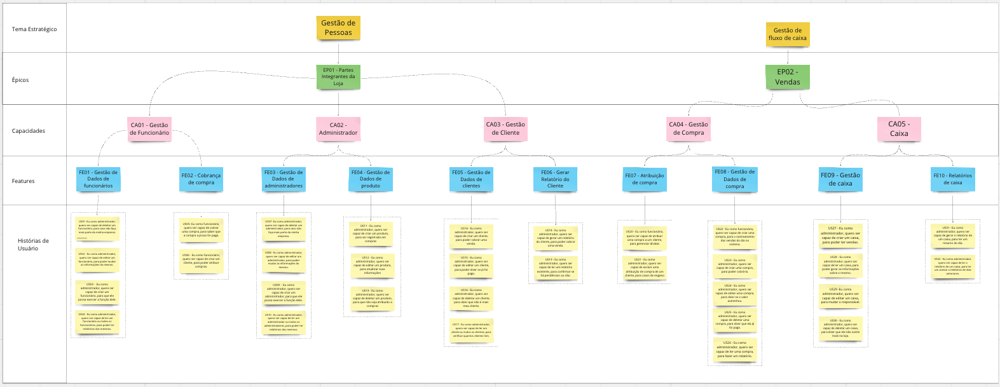
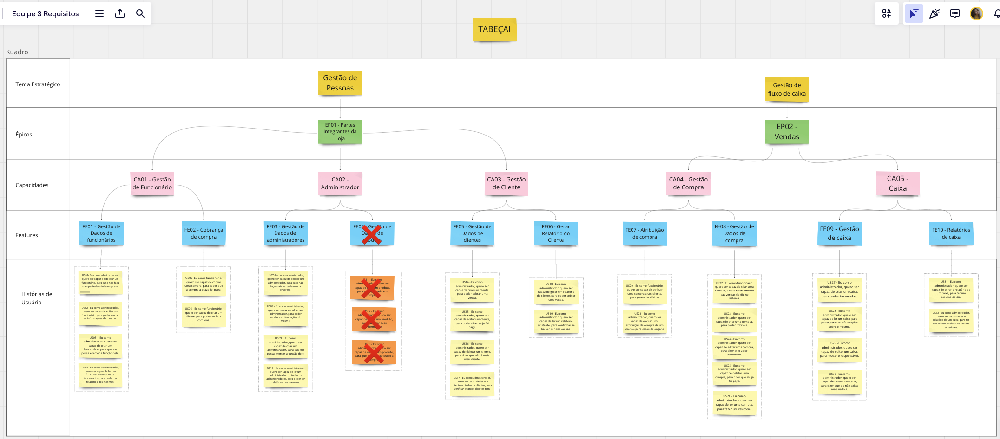

### Diagrama SAFe (inicialmente Proposto)

### Diagrama SAFe (final)
Exclusão da Feature de Dados De Produto

### Requisitos Funcionais

| Epico                             | Capacidade                   | Feature                                    | User Story                                                                                                                                                                                                                                                                                                                                                                                                                                                                                                                                       |
| --------------------------------- | ---------------------------- | ------------------------------------------ | ------------------------------------------------------------------------------------------------------------------------------------------------------------------------------------------------------------------------------------------------------------------------------------------------------------------------------------------------------------------------------------------------------------------------------------------------------------------------------------------------------------------------------------------------ |
| EP01 - Partes Integrantes da Loja | CA01 - Gestão de Funcionário | FE01 - Gestão de Dados de funcionários     | US01 - Eu como administrador, quero ser capaz de deletar um funcionário, para caso não faça mais parte da minha empresa.  US02 - Eu como administrador, quero ser capaz de editar um funcionário, para poder mudar as informações do mesmo.  US03 -  Eu como administrador, quero ser capaz de criar um funcionário, para que ele possa exercer a função dele.  US04 - Eu como administrador, quero ser capaz de ler um funcionário ou todos os funcionários, para poder ter relatórios dos mesmos.                            |
| EP01 - Partes Integrantes da Loja | CA01 - Gestão de Funcionário | FE02 - Cobrança de compra                  | US05- Eu como funcionário, quero ser capaz de cobrar uma compra, para saber que a compra a prazo foi paga.   US06 - Eu como funcionário, quero ser capaz de criar um cliente, para poder atribuir compras.                                                                                                                                                                                                                                                                                                                                 |
| EP01 - Partes Integrantes da Loja | CA02 - Administrador         | FE03 - Gestão de Dados de  administradores | US07 - Eu como administrador, quero ser capaz de deletar um administrador, para caso não faça mais parte da minha empresa.   US08 - Eu como administrador, quero ser capaz de editar um administrador, para poder mudar as informações do mesmo.   US09 -  Eu como administrador, quero ser capaz de criar um administrador, para que ele possa exercer a função dele.   US10 - Eu como administrador, quero ser capaz de ler um administrador ou todos os administradores, para poder ter relatórios dos mesmos.              |
| EP01 - Partes Integrantes da Loja | CA02 - Administrador         | <code style="color : red">FE04 - Gestão de Dados de produto</code>| <code style="color : red">US11 - Eu como administrador, quero ser capaz de criar um produto, para ser registrado em compras.</code>   <code style="color : red">US12 - Eu como administrador, quero ser capaz de editar um produto, para atualizar suas informações.</code>   <code style="color : red">US13 - Eu como administrador, quero ser capaz de deletar um produto, para que não seja atribuído a compras </code>                                                                                                                                                                                                               |
| EP01 - Partes Integrantes da Loja | CA03 - Gestão de Cliente     | FE05 - Gestão de Dados de clientes         | US14 - Eu como administrador, quero ser capaz de criar um cliente, para poder cobrar uma venda.   US15 - Eu como administrador, quero ser capaz de editar um cliente, para poder dizer se já foi pago.    US16 - Eu como administrador, quero ser capaz de deletar um cliente, para dizer que não é mais meu cliente.    US17 - Eu como administrador, quero ser capaz de ler um cliente ou todos os clientes, para verificar quantos clientes tem.                                                                            |
| EP01 - Partes Integrantes da Loja | CA03 - Gestão de Cliente     | FE06 - Gerar Relatório do Cliente          | US18 - Eu como administrador, quero ser capaz de gerar um relatório do cliente, para poder cobrar uma venda.    US19 - Eu como administrador, quero ser capaz de ler um relatório existente, para confirmar se há pendências ou não.                                                                                                                                                                                                                                                                                                       |
| EP02 - Vendas                     | CA04 - Gestão de Compra      | FE07 - Atribuição de compra                | US20 - Eu como funcionário, quero ser capaz de atribuir uma compra a um cliente, para gerenciar dívidas    US21 - Eu como administrador, quero ser capaz de excluir uma atribuição de compra de um cliente, para casos de engano                                                                                                                                                                                                                                                                                                           |
| EP02 - Vendas                     | CA04 - Gestão de Compra      | FE08 - Gestão de Dados de compra           | US22 - Eu como funcionário, quero ser capaz de criar uma compra, para o rastreamento das vendas do dia no sistema.    US23 - Eu como administrador, quero ser capaz de criar uma compra, para poder cobrá-la.    US24 - Eu como administrador, quero ser capaz de editar uma compra, para dizer se o valor aumentou.   US25 - Eu como administrador, quero ser capaz de deletar uma compra, para dizer que ela já foi paga.    US26 - Eu como administrador, quero ser capaz de ler uma compra, para fazer um relatório. |
| EP02 - Vendas                     | CA05 - Caixa                 | FE09 - Gestão de caixa                     | US27 - Eu como administrador, quero ser capaz de criar um caixa, para poder ter vendas.    US28 - Eu como administrador, quero ser capaz de ler um caixa, para poder gerar as informações sobre o mesmo.    US29 -Eu como administrador, quero ser capaz de editar um caixa, para mudar o responsável.    US30 - Eu como administrador, quero ser capaz de deletar um caixa, para dizer que ele não existe mais na loja.                                                                                                       |
| EP02 - Vendas                     | CA05 - Caixa                 | FE10 - Relatórios de caixa                 | US31 - Eu como administrador, quero ser capaz de gerar o relatório de um caixa, para ter um resumo do dia.    US32 - Eu como administrador, quero ser capaz de ler o relatório de um caixa, para ter um acesso a relatórios de dias anteriores.                                                                                                                                                                                                                                                                                            |

### Requisitos Não Funcionais

| Código | Tipo           | Descrição                                                                                                               |     |
| ------ | -------------- | ----------------------------------------------------------------------------------------------------------------------- | --- |
| RNF01  | Desempenho     | A aplicação deve ser capaz de lidar com um volume de tráfego de 100 usuários simultâneos.                               |     |
| RNF02  | Portabilidade  | A aplicação deve ser compatível com as versões de até dezembro de 2023 dos navegadores Chrome, Safari, Firefox e Brave. |     |
| RNF03  | Confiabilidade | Deve garantir que apenas aqueles registrados no sistema tenham acesso a aplicação.                                      |     |
| RNF04  | Escalabilidade | A aplicação deve ser capaz de aumentar sua capacidade para acomodar o crescimento de dados ou usuários.                 |     |
| RNF05  | Interface      | A aplicação deve manter um estilo de design consistente em toda a interface, incluindo fontes, cores e ícones.          |     |
| RNF06  | Interface      | A interface deve ser responsiva, adaptando-se a diferentes tamanhos de tela e dispositivos, como smartphones e tablets. |     |

### Critérios de Aceitação

#### FE01 - Gestão de Dados de funcionários
