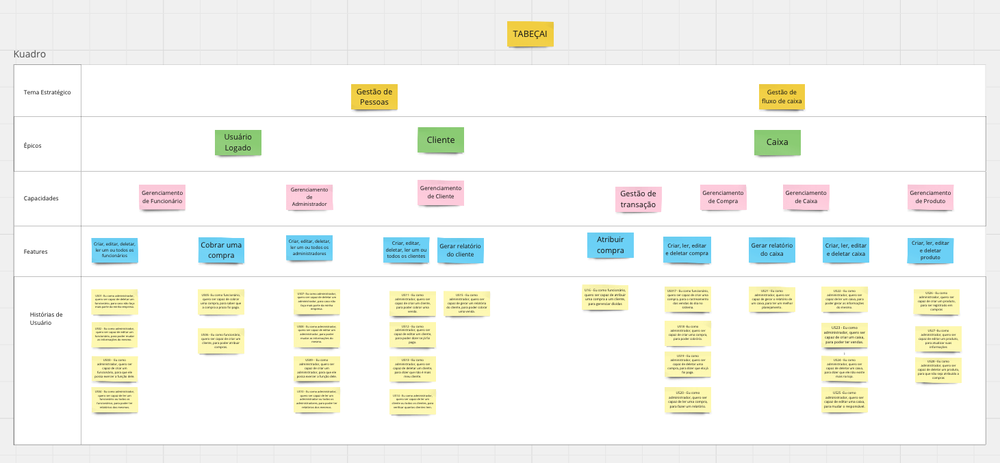
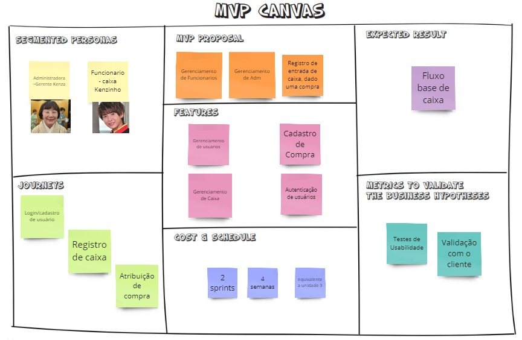
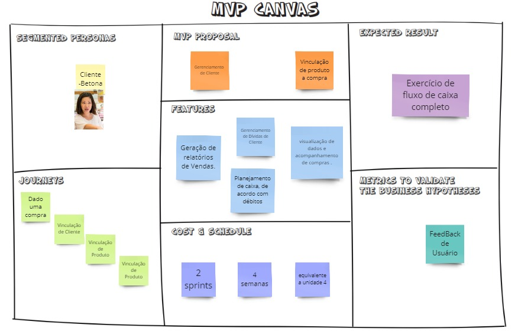

## Apresentação do Backlog (MVP1 e MVP2)

### Material

<iframe src='https://miro.com/app/board/uXjVMmS3Ge8=/?share_link_id=305468132627' width='100%' height='480px' style='min-width: 640px; min-height: 480px; background-color: #f4f4f4; border: 1px solid #efefef' sandbox='allow-same-origin allow-scripts allow-modals allow-popups allow-popups-to-escape-sandbox'></iframe>

<iframe src="https://docs.google.com/spreadsheets/d/1BByKMtw2mTWuHRrDaG2G6g-gfbWWK0qt8QIfiatT10Q/edit?usp=sharing" width='100%' height='480px' style='min-width: 640px; min-height: 480px; background-color: #f4f4f4; border: 1px solid #efefef' sandbox='allow-same-origin allow-scripts allow-modals allow-popups allow-popups-to-escape-sandbox'></iframe>

### Diagrama SAFe

### Canvas MVP 1 e MVP 2

A imagem acima mostra um MVP 1 para um sistema de gerenciamento de caixa. A imagem mostra que o MVP 1 é um produto básico que pode ser usado para registrar vendas e entradas de caixa.

A imagem mostra que o MVP 1 inclui as seguintes funcionalidades:

- Autenticação de usuários: Os usuários devem ser capazes de se autenticar no sistema usando um nome de usuário e senha.
- Registro de entrada de caixa: Os funcionários de caixa devem ser capazes de registrar entradas de caixa, incluindo o valor da venda, o produto vendido e o funcionário de caixa responsável.

A imagem acima mostra um MVP 2 para o mesmo sistema de gerenciamento de caixa. A imagem mostra que o MVP 2 é um produto mais completo que o MVP 1.

A imagem mostra que o MVP 2 inclui as seguintes funcionalidades:

- Autenticação de usuários: Os usuários devem ser capazes de se autenticar no sistema usando um nome de usuário e senha.
- Registro de entrada de caixa: Os funcionários de caixa devem ser capazes de registrar entradas de caixa, incluindo o valor da venda, o produto vendido e o funcionário de caixa responsável.
- Vinculação de produto a compra: Os funcionários de caixa devem ser capazes de vincular produtos a compras.
- Geração de relatórios de vendas: Os gerentes de loja devem ser capazes de gerar relatórios de vendas, incluindo o valor das vendas, os produtos vendidos e os funcionários de caixa responsáveis.

### Apresentação

---iframe video -----

| Data     | Versão | Descrição                             | Autor(es) | Revisor(es) |
| -------- | ------ | ------------------------------------- | --------- | ----------- |
| 24/05/23 | `1.0`  | Vídeo sobre a apresentação do Backlog | Alguém    |
| 22/06/23 | `1.1`  | Adicionando material                  | Maicon    |

### Definição das atividades presentes em cada MVP

No nosso projeto, a análise de viabilidade para construção dos MVP`s foi feito ultilizando Matriz de priorização, afim de se identificar o que é mais importante, ela conta com 2 critérios: Valor de negócio (VALOR) e Complexidade Técnica (ESFORÇO).    
Na tabela a seguir, referente a Valor de Negócio, cada US recebe uma nota de 1 a 5, aparti de 3 sub-tópicos:

- Necessário;

  - Fundamental para o funcionamento eficaz do negócio.

- Urgente;,

  - Precisam ser atendidas imediatamente. De impacto imediato nos resultados ou na continuidade do produto.

- Desejavel;
  - Aprimoramento, visando a satisfação do cliente.

Na coluna, Média Complexidade Técnica, cada US possui a media das notas dadas por cada integrante do grupo, de 1 a 5, aparti de 2 sub-tópicos:

- Tempo para realizar a Atividade;
- Nível de difulculdade de execução;

| _US_                                                                                                                                       | _É necessário?(2pt)_ | _É urgente? (2pts)_ | _É desejavel? (1pt)_ | _Soma Valor de Negócio_ | _Média Complexidade Técnica_ |
| ------------------------------------------------------------------------------------------------------------------------------------------ | -------------------- | ------------------- | -------------------- | ----------------------- | ---------------------------- |
| [*US01*] Eu como administrador, quero ser capaz de deletar um funcionário, para caso não faça mais parte da minha empresa.                 | 2                    | 2                   | 1                    | 5                       |
| [*US02*] Eu como administrador, quero ser capaz de editar um funcionário, para poder mudar as informações do mesmo.                        | 2                    | 1                   | 1                    | 4                       |
| [*US03*] Eu como administrador, quero ser capaz de criar um funcionário, para que ele possa exercer a função dele.                         | 2                    | 2                   | 1                    | 5                       |
| [*US04*] Eu como administrador, quero ser capaz de ler um funcionário ou todos os funcionários, para poder ter relatórios dos mesmos.      | 2                    | 2                   | 1                    | 5                       |
| [*US05*] Eu como funcionário, quero ser capaz de cobrar uma compra, para saber que a compra a prazo foi paga.                              | 1                    | 2                   | 1                    | 4                       |
| [*US06*] Eu como funcionário, quero ser capaz de criar um cliente, para poder atribuir compras.                                            | 1                    | 2                   | 1                    | 4                       |
| [*US07*] Eu como administrador, quero ser capaz de deletar um administrador, para caso não faça mais parte da minha empresa.               | 2                    | 2                   | 1                    | 5                       |
| [*US08*] Eu como administrador, quero ser capaz de editar um administrador, para poder mudar as informações do mesmo.                      | 2                    | 2                   | 1                    | 5                       |
| [*US09*] Eu como administrador, quero ser capaz de criar um administrador, para que ele possa exercer a função dele.                       | 2                    | 2                   | 1                    | 5                       |
| [*US10*] Eu como administrador, quero ser capaz de ler um administrador ou todos os administradores, para poder ter relatórios dos mesmos. | 2                    | 2                   | 1                    | 5                       |
| [*US11*] Eu como administrador, quero ser capaz de criar um cliente, para poder cobrar uma venda.                                          | 2                    | 0                   | 1                    | 3                       |
| [*US12*] Eu como administrador, quero ser capaz de editar um cliente, para poder dizer se já foi pago.                                     | 2                    | 0                   | 1                    | 3                       |
| [*US13*] Eu como administrador, quero ser capaz de deletar um cliente, para dizer que não é mais meu cliente.                              | 2                    | 0                   | 1                    | 3                       |
| [*US14*] Eu como administrador, quero ser capaz de ler um cliente ou todos os clientes, para verificar quantos clientes tem.               | 2                    | 0                   | 1                    | 3                       |
| [*US15*] um relatória do cliente, para poder cobrar uma venda.                                                                             | 1                    | 0                   | 1                    | 2                       |
| [*US16*] Eu como funcionário, quero ser capaz de atribuir uma compra a um cliente, para gerenciar dívidas.                                 | 1                    | 0                   | 1                    | 2                       |
| [*US17*] Eu como funcionário, quero ser capaz de criar uma compra, para o rastreamento das vendas do dia no sistema.                       | 2                    | 2                   | 1                    | 5                       |
| [*US18*] Eu como administrador, quero ser capaz de criar uma compra, para poder cobrá-la.                                                  | 2                    | 2                   | 1                    | 5                       |
| [*US19*] Eu como administrador, quero ser capaz de editar uma compra, para dizer se o valor aumentou.                                      | 2                    | 1                   | 1                    | 4                       |
| [*US20*] Eu como administrador, quero ser capaz de deletar uma compra, para dizer que ela já foi paga.                                     | 2                    | 2                   | 1                    | 5                       |
| [*US21*] Eu como administrador, quero ser capaz de ler uma compra, para fazer um relatório.                                                | 1                    | 1                   | 1                    | 3                       |
| [*US22*] o relatório de um caixa, para ter um melhor planejamento.                                                                         | 2                    | 2                   | 1                    | 5                       |
| [*US23*] Eu como administrador, quero ser capaz de ler um caixa, para poder gerar as informações do mesmo.                                 | 2                    | 2                   | 1                    | 5                       |
| [*US24*] Eu como administrador, quero ser capaz de deletar um caixa, para dizer que ele não existe mais na loja.                           | 2                    | 2                   | 1                    | 5                       |
| [*US25*] Eu como administrador, quero ser capaz de editar uma caixa, para mudar o responsável.                                             | 2                    | 2                   | 1                    | 5                       |
| [*US26*] Eu como administrador, quero ser capaz de editar uma caixa, para mudar o responsável.                                             | 2                    | 1                   | 1                    | 4                       |
| [*US27*] Eu como administrador, quero ser capaz de criar um produto, para ser registrado em compras.                                       | 2                    | 2                   | 1                    | 5                       |
| [*US28*] Eu como administrador, quero ser capaz de editar um produto, para atualizar suas informações.                                     | 2                    | 1                   | 1                    | 4                       |
| [*US29*] Eu como administrador, quero ser capaz de deletar um produto, para que não seja atribuído a compras.                              | 2                    | 2                   | 1                    | 5                       |

Cada Épico receberá seu grau de prioridade de acordo com a média ponderada desses critérios para cada US: (ESFORÇO + (VALOR DO ÉPICO \* 2))/3 = PONDERAÇÃO.
Um Épico pode ter sido Sub-divido, contemplando apenas uma parte das suas US`s.

- Esforço -> Soma das Médias da Complexidade Técnica das US`s relacionadas
- Valor do Épico -> Soma das Médias da Complexidade Técnica das US`s relacionadas

| Epico           | Capacidade                                    | História de usuário           | Esforço | Valor do Épico | Ponderação |
| --------------- | --------------------------------------------- | ----------------------------- | ------- | -------------- | ---------- |
| Usuarios Logado | Usuarios Logado                               | US01, US02, US03, US04        | 6.67    | 19             | 14.9       |
| Usuarios Logado | Gerenciamento de Funcionário                  | US05, US06                    | 3.4     | 8              | 6.4        |
| Usuarios Logado | Gerenciamento de Administrador                | US07, US08, US09, US10        | 6,4     | 19             | 14.08      |
| Cliente         | Gerenciamento de Cliente                      | US11, US12, US13, US14        | 11.5    | 17             | 15.16      |
| Caixa           | Gestão de transação e Gerenciamento de Compra | US16, US17, US18, US19, US20, | 13.3    | 25             | 21.1       |
| Caixa           | Gerenciamento de Caixa                        | US23, US24, US25, US26        | 9.9     | 19             | 15.96      |
| Caixa           | Gerenciamento de Produto                      | US27, US28, US29              | 2,9     | 14             | 10.3       |

Dados os Pesos, a ideia para a construção e divisão dos MVP's, deu-se a parti de buscar realizar primeiramente parte dos Épicos, cujas tarefas possuam maior Prioridade (Valor), mas menor esforço.

### MVP 1

| MVP 1                                                                                                                                                                                                                                                                                                                                                                                                                                                                                                                  | Justificativa                                                                                                                       |
| :--------------------------------------------------------------------------------------------------------------------------------------------------------------------------------------------------------------------------------------------------------------------------------------------------------------------------------------------------------------------------------------------------------------------------------------------------------------------------------------------------------------------- | :---------------------------------------------------------------------------------------------------------------------------------- |
| US01 - Eu como administrador, quero ser capaz de deletar um funcionário, para caso não faça mais parte da minha empresa.  US02 - Eu como administrador, quero ser capaz de editar um funcionário, para poder mudar as informações do mesmo US03 - Eu como administrador, quero ser capaz de criar um funcionário, para que ele possa exercer a função dele. US04 - Eu como administrador, quero ser capaz de ler um funcionário ou todos os funcionários, para poder ter relatórios dos mesmos.               | O administrador deve ser capaz de poder ter funcionarios e manipular eles no programa.                                              |
| US07 - Eu como administrador, quero ser capaz de deletar um administrador, para caso não faça mais parte da minha empresa.   US08 - Eu como administrador, quero ser capaz de editar um administrador, para poder mudar as informações do mesmo. US09 -  Eu como administrador, quero ser capaz de criar um administrador, para que ele possa exercer a função dele. US10 - Eu como administrador, quero ser capaz de ler um administrador ou todos os administradores, para poder ter relatórios dos mesmos. | O administrador deve ser capaz de colocar outras pessoas com o cargo de administrador para também ter o controle total do programa. |
| US017 - Eu como funcionário, quero ser capaz de criar uma compra, para o rastreamento das vendas do dia no sistema.   US19 - Eu como administrador, quero ser capaz de editar uma compra, para dizer se o valor aumentou.                                                                                                                                                                                                                                                                                        | O funcionario e o administrador deve ter acesso a venda feita.                                                                      |
| US21 - Eu como administrador, quero ser capaz de ler uma compra, para fazer um relatório.                                                                                                                                                                                                                                                                                                                                                                                                                              | O administrador deve ser capaz de ler uma compra pra ter o relatorio da mesma.                                                      |
| US22 - Eu como administrador, quero ser capaz de ler uma compra, para fazer um relatório.                                                                                                                                                                                                                                                                                                                                                                                                                              | O administrador deve ser capaz de ter relatorios de seus caixas.                                                                    |
| US23 - Eu como administrador, quero ser capaz de criar um caixa, para poder ter vendas. US24 - Eu como administrador, quero ser capaz e deletar um caixa, para dizer que ele não existe mais na loja. US25 -Eu como administrador, quero ser capaz de editar uma caixa, para mudar o responsável. US26 - Eu como administrador, quero ser capaz de ler um caixa, para poder gerar as informações do mesmo.                                                                                                    | O administrador deve ser capaz de ter o controle total do caixa, desde criar um novo ate deletar o mesmo.                           |
| US27 - Eu como administrador, quero ser capaz de criar um produto, para ser registrado em compras. US28 - Eu como administrador, quero ser capaz de editar um produto, para atualizar suas informações. US29 - Eu como administrador, quero ser capaz de deletar um produto, para que não seja atribuído a compras                                                                                                                                                                                               | O administrador deve ser capaz de criar um produto para ele ser colocado a venda.                                                   |

### MVP 2

| MVP 2                                                                                                                                                                                                                                                                                                                                                                                                                                                | Justificativa                                                                                                       |
| :--------------------------------------------------------------------------------------------------------------------------------------------------------------------------------------------------------------------------------------------------------------------------------------------------------------------------------------------------------------------------------------------------------------------------------------------------- | :------------------------------------------------------------------------------------------------------------------ |
| US05 - Eu como funcionário, quero ser capaz de cobrar uma compra, para saber que a compra a prazo foi paga. US06 - Eu como funcionário, quero ser capaz de criar um cliente, para poder atribuir compras.                                                                                                                                                                                                                                         | O funcionario deve poder criar um cliente e atribuir uma venda a ele para poder cobra-la depois.                    |
| US11 - Eu como administrador, quero ser capaz de criar um cliente, para poder cobrar uma venda. US12 - Eu como administrador, quero ser capaz de editar um cliente, para poder dizer se já foi pago. US13 - Eu como administrador, quero ser capaz de deletar um cliente, para dizer que não é mais meu cliente. US14 - Eu como administrador, quero ser capaz de ler um cliente ou todos os clientes, para verificar quantos clientes tem. | O administrador deve poder manipular um cliente desde cria-lo ate poder deletar e saber quantos tem.                |
| US15 - Eu como administrador, quero ser capaz de gerar um relatório do cliente, para poder cobrar uma venda.                                                                                                                                                                                                                                                                                                                                         | O administrador deve ser capaz de gerar o relatório de um cliente para cobrar uma venda ou várias do mesmo cliente. |
| US16 - Eu como funcionário, quero ser capaz de atribuir uma compra a um cliente, para gerenciar dívidas.                                                                                                                                                                                                                                                                                                                                             | O funcionario deve poder atribuir uma venda a um cliente para poder cobra-lo no futuro.                             |
| US18 - Eu como administrador, quero ser capaz de criar uma compra, para poder cobrá-la. US20 - Eu como administrador, quero ser capaz de deletar uma compra, para dizer que ela já foi paga.                                                                                                                                                                                                                                                      | O administrador deve ser capaz de criar uma compra e atribuir a um cliente e deve poder deletar a mesma.            |
