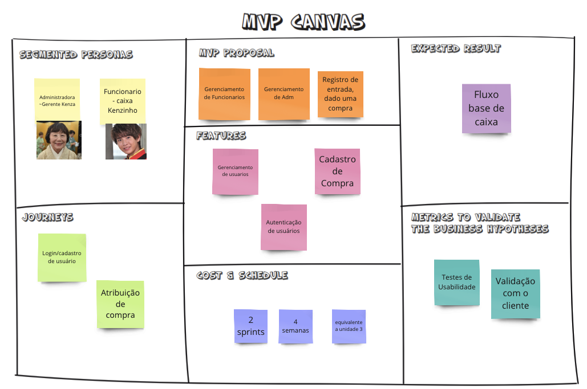
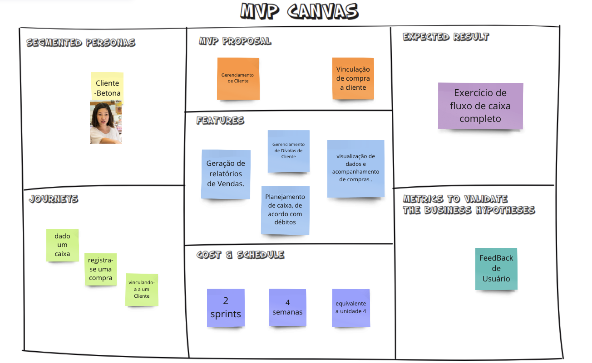

## Apresentação do Backlog (MVP1 e MVP2)

### Material
<iframe src='https://miro.com/app/board/uXjVMmS3Ge8=/?share_link_id=305468132627' width='100%' height='480px' style='min-width: 640px; min-height: 480px; background-color: #f4f4f4; border: 1px solid #efefef' sandbox='allow-same-origin allow-scripts allow-modals allow-popups allow-popups-to-escape-sandbox'></iframe>

<iframe src="https://docs.google.com/spreadsheets/d/1BByKMtw2mTWuHRrDaG2G6g-gfbWWK0qt8QIfiatT10Q/edit?usp=sharing" width='100%' height='480px' style='min-width: 640px; min-height: 480px; background-color: #f4f4f4; border: 1px solid #efefef' sandbox='allow-same-origin allow-scripts allow-modals allow-popups allow-popups-to-escape-sandbox'></iframe>

### Canvas MVP 1 e MVP 2

A imagem acima mostra um MVP 1 para um sistema de gerenciamento de caixa. A imagem mostra que o MVP 1 é um produto básico que pode ser usado para registrar vendas e entradas de caixa.

A imagem mostra que o MVP 1 inclui as seguintes funcionalidades:

* Autenticação de usuários: Os usuários devem ser capazes de se autenticar no sistema usando um nome de usuário e senha.
* Registro de entrada de caixa: Os funcionários de caixa devem ser capazes de registrar entradas de caixa, incluindo o valor da venda, o produto vendido e o funcionário de caixa responsável.

A imagem acima mostra um MVP 2 para o mesmo sistema de gerenciamento de caixa. A imagem mostra que o MVP 2 é um produto mais completo que o MVP 1.

A imagem mostra que o MVP 2 inclui as seguintes funcionalidades:

* Autenticação de usuários: Os usuários devem ser capazes de se autenticar no sistema usando um nome de usuário e senha.
* Registro de entrada de caixa: Os funcionários de caixa devem ser capazes de registrar entradas de caixa, incluindo o valor da venda, o produto vendido e o funcionário de caixa responsável.
* Vinculação de produto a compra: Os funcionários de caixa devem ser capazes de vincular produtos a compras.
* Geração de relatórios de vendas: Os gerentes de loja devem ser capazes de gerar relatórios de vendas, incluindo o valor das vendas, os produtos vendidos e os     funcionários de caixa responsáveis.

### Apresentação

---iframe video -----

Data | Versão | Descrição | Autor(es) | Revisor(es)
---- | ------ | --------- | ----- | ---------
24/05/23 | `1.0` | Vídeo sobre a apresentação do Backlog | Alguém 
22/06/23 | `1.1` | Adicionando material | Maicon 
