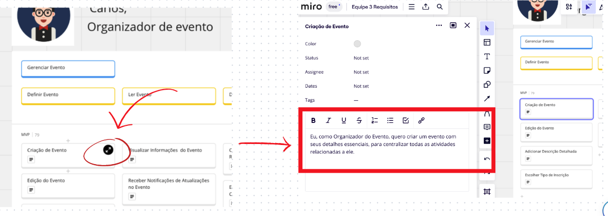

## PBB (Product Backlog Building)

<iframe width="768" height="432" src="https://miro.com/app/board/uXjVMmS3Ge8=/?moveToWidget=3458764569098248326&cot=14" frameborder="0" scrolling="no" allow="fullscreen; clipboard-read; clipboard-write" allowfullscreen></iframe>

## USM (User Stories Mapping )
<iframe width="768" height="432" src="https://miro.com/app/board/uXjVMmS3Ge8=/?moveToWidget=3458764570090694472&cot=14" frameborder="0" scrolling="no" allow="fullscreen; clipboard-read; clipboard-write" allowfullscreen></iframe>

 
Para vizualização das US, basta expandir os card's de acordo com o tutorial da imagem abaixo: 

