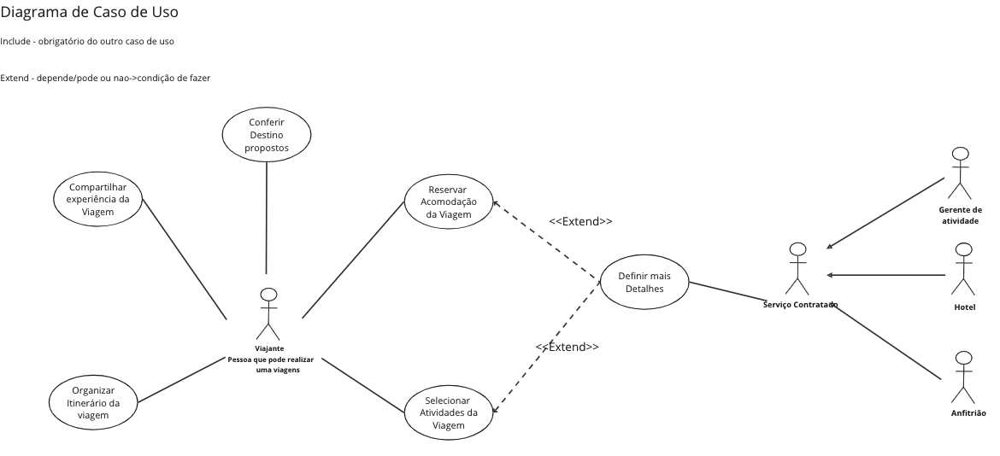

### Reunião com Cliente
<iframe width="768" height="432" src="https://www.youtube.com/watch?v=vuhkUjsRhJo" frameborder="0" scrolling="no" allow="fullscreen; clipboard-read; clipboard-write" allowfullscreen></iframe>

### Diagrama UML  

### Especificação de Caso de Uso  

#### Avaliar Serviço da Viagem

##### 1. Avaliar Serviço da Viagem
     1.1. Breve Descrição	
        Neste caso de uso permite-se ao viajante avaliar uma determinada experiência de viagem, acomodação ou atividade, já realizada por ele, adquirida a partir da aplicação. O FeedBack é salvo e registrado, tornando-se público aos demais viajantes interessados. Possibilitando que outros usuários possam averiguar a qualidade do serviço em questão e que o sistema entenda o gosto do viajante para futuras ofertas oferecidas.
    1.2. Ator    
        - Viajante

##### 2.	FLUXO BÁSICO	
    2.1. fluxo Principal	
        Este caso de uso é iniciado quando o viajante escolhe a opção "Avaliar Serviço da Viagem".
            2.1.1. O sistema lista todos os serviços com pendência de Avaliação [RN01] [FE01]	
            2.1.2. O Viajante seleciona o serviço que deseja avaliar 
            2.1.3. O Sistema gera perguntas de avaliação com base no serviço de viagem do viajante. [RN02] 	
            2.1.4. O viajante, a partir das perguntas feitas, avalia o serviço.	
            2.1.5. O Sistema registra a avaliação.	
            2.1.6. O caso de uso é encerrado.	

    2.2. Fluxo Alternativo
        Não se aplica

    2.3. Fluxo Alternativo
       2.3.1 [FE01] Não existir avaliação pendente
            No Passo 2.1.1 o sistema é responsável por listar todos os serviços com pendência de Avaliação, caso nenhuma pendência exista é exibido a mensagem “Não existem avaliações pendentes”. O sistema Avança para o passo 2.1.6

##### 3.	REQUISITOS ESPECIAIS
    Não se aplica

##### 4.	REGRAS DE NEGÓCIO
    4.1 [RN01] A listagem deve ser apresentada da Seguinte forma:
        4.1.1 Cada item da lista deve conter o tipo de serviço, nome, imagem associada a ele e a data de quando foi usufruído
        4.1.2 A lista deve ser ordenada, de maneira que as mais recentes estejam mais acima 

    4.2 [RN02] As perguntas de feedBack devem ser a:
        4.2.1 Quantitativas devem solicitar valores em uma escala de 0 a 5
        4.2.2 Textuais devem possuir limite de caracter, mas não são obrigatórias

##### 5.	PRECONDIÇÃO
    5.1. Login
        O viajante deve estar autenticado no sistema antes de acessar a funcionalidade de feedback da experiência de viagem.
    5.2.Uso de algum serviço
        O viajante deve ter concluído uma experiência de viagem associada à qual o feedback será fornecido.

##### 6.	PÓS-CONDIÇÃO
    Não se Aplica.
##### 7. POONTS DE EXTENSÃO E INCLUSÃO
    Não se Aplica.

