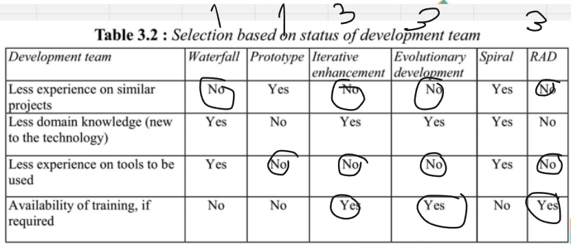
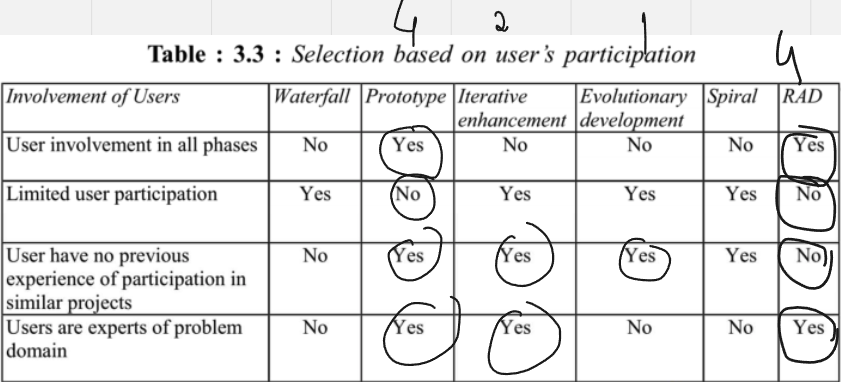
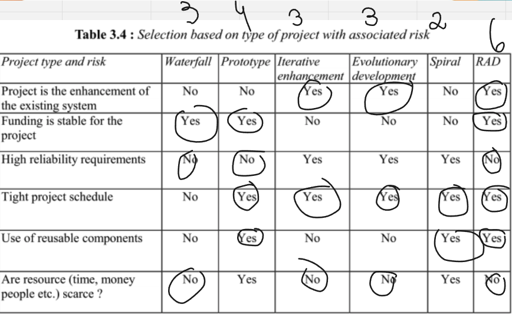
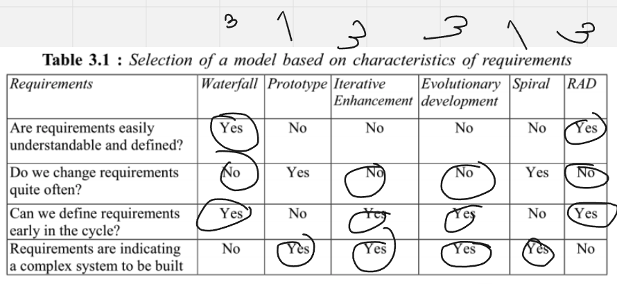
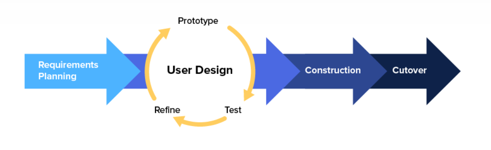

# 1. VISÃO GERAL DO PRODUTO

## 1.1 Problema

O problema em questão envolve a gestão do fluxo de caixa nas lojas da empresa. Atualmente, o sistema utilizado é chamado de Gladium, que é usado para fazer emissão de notas fiscais, mas que não faz o controle dos pagamentos a prazo. O controle das vendas a prazo é feito no excel pelo setor financeiro da empresa, ficando como responsabilidade dos caixas informar quais vendas foram a prazo ao setor. Todo esse processo exige uma mão de obra que necessita de um treinamento adequado dos funcionários para identificar e registrar tais pagamentos no Excel, além de ser suscetível a erros de comunicação, resultando em informações imprecisas. Além disso, há a falta de um sistema automatizado para importar informações de pix/transferências bancárias de maneira integrada ao sistema utilizado atualmente pela empresa, o que pode incorrer em erros de transcrição. Tais erros foram, inclusive, notados pela cliente durante o processo de explicação do problema ao consultar algumas das planilhas. Diante disso, vemos uma clara dependência excessiva de processos manuais para registrar os pagamentos a prazo às vendas/cobranças. Toda essa falta de uma estrutura organizacional eficiente para armazenar os extratos bancários e documentos relacionados aos pagamentos, aliado a erros que possam ser provenientes do ambiente de trabalho, tal como distrações durante o processo, além da falta de sistemas de verificação de erros para garantir a precisão desses dados registrados no Excel, tornam todo o trabalho suscetível a erros, como os relatados pela cliente.

## 1.2 Declaração de Posição do Produto

| Para          | comerciantes                                                                                                                                                                                                                                                                                                                                                        |
| ------------- | ------------------------------------------------------------------------------------------------------------------------------------------------------------------------------------------------------------------------------------------------------------------------------------------------------------------------------------------------------------------- |
| Quem          | que precisam de uma forma de gerenciar o fluxo dos caixas das lojas de diversos meios de pagamento                                                                                                                                                                                                                                                                  |
| O Tabeçai     | é uma aplicação web de dashboard que serve como organizador e agregador de transações                                                                                                                                                                                                                                                                               |
| Que           | faz o controle de vendas tanto a vista quanto a prazo de maneira integrada com os caixas, a fim de melhorar a comunicação com o setor financeiro da empresa, assim produzindo resultados confiáveis e de maneira eficiente                                                                                                                                          |
| Ao contrário  | do sistema atualmente usado na empresa, chamado Gladium, que é uma plataforma para fazer as vendas (emissão de notas fiscais)                                                                                                                                                                                                                                       |
| Nosso produto | Consegue fazer o controle de pagamentos feitos a prazo, além de tirar o processo manual de transcrever as informações de pix e de transferências recebidas dos extratos bancários. Podendo também atrelar determinado pix à venda/cobrança informado pelo caixa, e produzir informações úteis sobre os resultados financeiros do dia ou de algum intervalo de tempo |

## 1.3 Objetivos do Produto

O objetivo do desenvolvimento deste produto é automatizar a administração do fluxo de caixa de todas as lojas, a fim de gerar resultados confiáveis, sem ter a necessidade do setor financeiro perder tempo checando transação por transação se os valores estão corretos ou não. O atual processo manual de registro de transações em planilhas, que demonstrou ser propenso a erros, será substituído por um sistema automatizado, fornecendo uma solução de software que otimize o gerenciamento do fluxo de caixa, minimizando erros, economizando tempo e recursos e proporcionando maior segurança nas operações financeiras das lojas em questão.

### Metodologia de Desenvolvimento

** Baseado no Framework de Gupta (2019), respondemos um conjunto de questões sobre os tópicos abordados pelo Framework para definir o modelo de desenvolvimento que será utilizado no projeto.**

**Requisitos:**

##### Figura 3 - Modelo Gupta para requisitos (fonte: Gupta, 2019)

| Pergunta                                                             | Nossa resposta |
| -------------------------------------------------------------------- | -------------- |
| Os requisitos são fáceis de entender e definir?                      | Sim            |
| Nós mudamos os requisitos com bastante frequência?                   | Não            |
| Nós podemos definir os requisitos ao início de cada ciclo?           | Sim            |
| Os requisitos estão indicando um sistema complexo para se construir? | Sim            |

##### Na conclusão do primeiro modelo de Gupta baseado nos requisitos, podemos perceber que o nosso projeto é complexo, porém, os requisitos são fáceis de entender e definir, e podemos definir os requisitos ao início de cada ciclo.

**Equipe de Desenvolvimento:**

 
##### Figura 4 - Modelo Gupta para equipe de desenvolvimento (fonte: Gupta, 2019)

| Pergunta                                               | Nossa resposta |
| ------------------------------------------------------ | -------------- |
| Pouca experienca em projetos similares                 | Não            |
| Pouca experiência em tecnologias similares             | Sim            |
| Pouca experiência com as ferramentas que serão usadas? | Não            |
| Disponibilidade para treinamento, se necessário        | Sim            |

##### Na conclusão do segundo modelo de Gupta baseado na equipe de desenvolvimento, podemos perceber que temos uma boa experiência em projetos similares, porém, temos pouca experiência em tecnologias similares, mas temos disponibilidade para treinamento, se necessário.

**Usuários:**

##### Figura 5 - Modelo Gupta para usuários (fonte: Gupta, 2019)

| Pergunta                                                                    | Nossa resposta |
| --------------------------------------------------------------------------- | -------------- |
| Envolvimento dos usuários                                                   | Sim            |
| Participação limitada dos usuários                                          | Não            |
| Usuário não tem experiência anterior em participação em projetos similares? | Não            |
| Usuário são especialistas no domínio do problema?                           | Sim            |

##### Na conclusão do terceiro modelo de Gupta baseado nos usuários, podemos perceber que temos um bom envolvimento dos usuários, e que os usuários são especialistas no domínio do problema.

**Tipo de Projeto e Risco Associado:**

##### Figura 6 - Modelo Gupta para tipo de projeto e risco associado (fonte: Gupta, 2019)

| Pergunta                                                   | Nossa resposta |
| ---------------------------------------------------------- | -------------- |
| O projeto é melhoria de um sistema existente?              | Sim            |
| O financiamento está estável para o projeto?               | Sim            |
| Requisitos de alta confiabilidade?                         | Não            |
| Cronograma do projeto é apertado?                          | Sim            |
| Uso de componentes reutilizáveis?                          | Sim            |
| Os recursos (Tempo, dinheiro, pessoas etc) estão escassos? | Não            |

##### Na conclusão do quarto modelo de Gupta baseado no tipo de projeto e risco associado, podemos perceber que o projeto é melhoria de um sistema existente, o financiamento está estável para o projeto, o cronograma do projeto é apertado e o uso de componentes reutilizáveis.

### Escolha do Modelo do Processo de Desenvolvimento

**_Figura 7 - Procedimento do RAD ( Fonte: George Marsicano, 2023 )_**

Considerando todas as características do projeto, a equipe optou por utilizar o modelo RAD (Rapid Application Development), pois o projeto é de médio porte, com um prazo de entrega curto, a equipe tem experiência em projetos similares, e o projeto é uma melhoria de um sistema existente, o que facilita o desenvolvimento.A abordagem será hibrida com o modelo cascata para garantir a parte de levamento de requisitos e nas partes seguintes do desenvolvimento, o modelo RAD será utilizado.

### Ferramentas

Abaixo irei citar algumas das ferramentas que nossa equipe irá utilizar para o desenvolvimento do projeto.

| Ferramenta                               | Finalidade                             |
| ---------------------------------------- | -------------------------------------- |
| [Discord](https://discord.com/)          | Comunicação entre os membros da equipe |
| [Figma](https://www.figma.com/)          | Prototipação                           |
| [GitHub](https://github.com/)            | Repositório de código                  |
| [VSCode](https://code.visualstudio.com/) | Editor de código                       |
| [Whimsical](https://whimsical.com/)      | Fluxograma                             |
