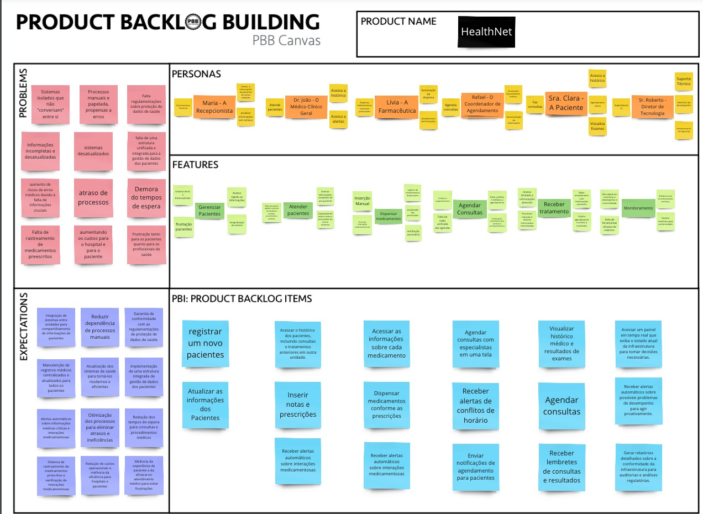
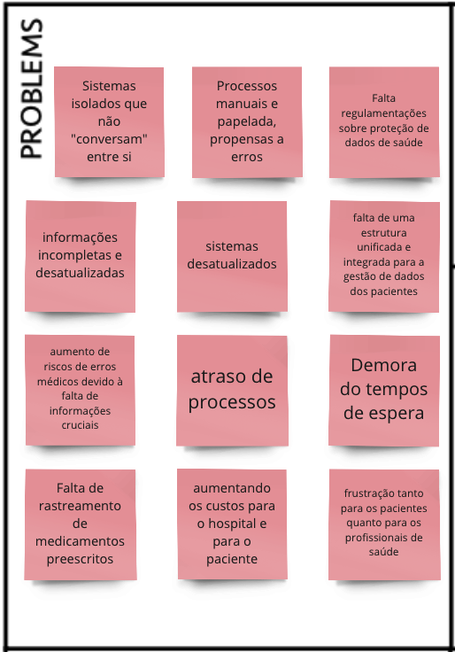
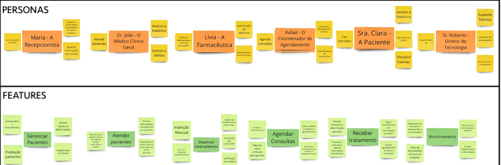
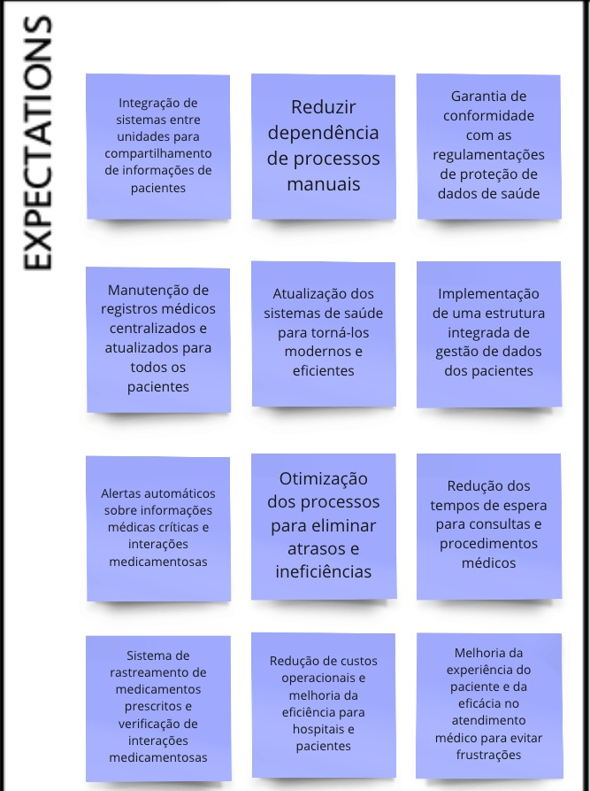
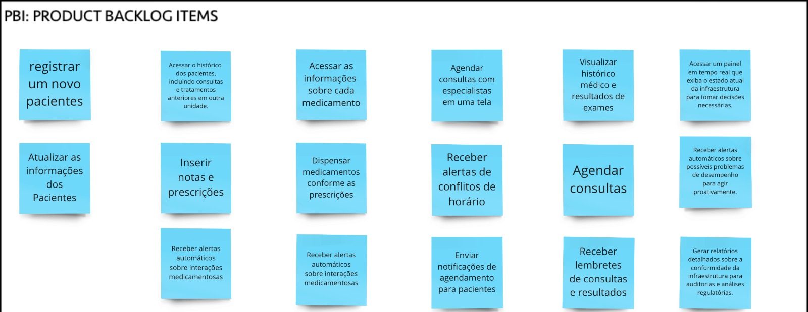

# Exercício de Construção de Backlog de Produto usando PBB (Product Backlog Building)

Este documento constitui a documentação oficial da atividade de Product Backlog Building (PBB), orientada pelo Prof. Dr. George Marsicano. 

A atividade se baseia em um estudo de caso focado na "HealthNet", uma extensa rede de clínicas e hospitais enfrentando desafios significativos em sua operação diária. Ao longo desta atividade, foram explorados os desafios enfrentados pelas diversas personas da "HealthNet", assim como suas expectativas e necessidades. Essas informações foram empregadas para definir e priorizar os itens do backlog, visando o desenvolvimento de uma visão holística do produto, compreendendo tanto o panorama técnico quanto as nuances humanas por trás dele.

Devido a dificuldade de visualização, abaixo segue os fragmentos do Product Backlog BuilDing

## PBI

## User Stories, Critérios de Aceitação e BDD
| User Story | Critérios de Aceitação | Cenário BDD |
|------------|------------------------| ----------- |
| US01 - Eu, como recepcionista, quero registrar um novo paciente, para que eu possa manter um registro do mesmo. | 1 - Quando o usuário (recepcionista) acessar a interface de registro de pacientes, deve haver um formulário para inserir as informações necessárias.   2 - O formulário de registro deve incluir campos obrigatórios para informações essenciais, como nome completo, data de nascimento, sexo, endereço, número de telefone e e-mail do paciente.   3 - O sistema deve realizar validações adequadas para garantir a integridade dos dados inseridos. Mensagens de erro claras devem ser exibidas se informações obrigatórias estiverem ausentes ou se o formato dos dados estiver incorreto.   4 - Cada paciente registrado deve ser atribuído a um número de registro único para facilitar a identificação e referência futura.   5 - A funcionalidade de registro de pacientes deve ser acessível apenas para usuários autorizados, neste caso, os recepcionistas.   6 - Após o registro bem-sucedido, o sistema deve exibir uma confirmação visual para o recepcionista, indicando que o paciente foi registrado com sucesso. | Registro de Novo Paciente:   Dado que um novo paciente chega à clínica.   Quando o recepcionista cadastra as informações de registro no formulário.   Então, o sistema gera um número de identificação único e confirma o registro do paciente. |
| US02 - Eu, como recepcionista, quero atualizar dados de um paciente, para que eu possa ter todos os seus dados mais recentes. | 1- Antes de permitir a atualização de dados, o sistema deve autenticar o usuário como um recepcionista autorizado.   2 - A interface de atualização deve permitir a busca e seleção fácil do paciente cujos dados serão atualizados. Pode ser por nome completo, número de registro ou outro identificador único.   3 - Somente os campos relevantes devem ser editáveis. Por exemplo, informações sensíveis ou críticas podem ter restrições de edição para garantir a integridade dos dados.   4 - O sistema deve realizar verificações de validação para garantir que os dados atualizados estejam corretos e no formato adequado. Mensagens de erro claras devem ser exibidas em caso de problemas.   5 - Após uma atualização bem-sucedida, o sistema deve exibir uma mensagem de confirmação para o recepcionista, indicando que os dados foram atualizados com sucesso. | Atualização de Dados do Paciente:   Dado que há a necessidade de alterações nos dados de um paciente existente.   Quando o recepcionista atualiza as informações necessárias.   Então, o sistema confirma a atualização e mantém os dados atualizados. |
| US03 - Eu, como recepcionista, quero acessar o histórico do paciente, para que eu possa consultar dados sobre consultas anteriores. | 1 - Antes de permitir o acesso ao histórico do paciente, o sistema deve autenticar o usuário como um recepcionista autorizado.   2 - A interface de acesso ao histórico deve permitir a busca e seleção fácil do paciente cujo histórico será consultado. Pode ser por nome completo, número de registro ou outro identificador único.   3 - O histórico do paciente deve conter informações relevantes, como datas de consultas anteriores, diagnósticos, prescrições médicas, exames realizados e quaisquer notas relevantes feitas por profissionais de saúde.   4 - Garanta que o acesso ao histórico do paciente seja restrito apenas a usuários autorizados e que as informações sejam protegidas de acordo com as normas de privacidade e segurança de dados. | Consulta do Histórico do Paciente:   Dado que o paciente possui informações sobre as consultas anteriores.   Quando o recepcionista seleciona o paciente.   Então, o sistema exibe o histórico de consultas anteriores. |
| US04 - Eu, como médico clínico geral, quero ter acesso aos detalhes do histórico de um paciente antes da consulta, para oferecer um atendimento personalizado. | - Criar uma barra de pesquisa na interface principal.   - Implementar filtros de busca por nome completo, número de registro ou identificador único.   - Exibir as informações do paciente de forma clara e organizada na interface.   - Implementar sistema de autenticação para garantir acesso apenas a médicos autorizados   - Incluir botões de navegação rápida entre diferentes seções do histórico.   - Otimizar a responsividade da interface para garantir uma experiência de usuário fluida. | Revisão do Histórico antes da Consulta:   Dado que um paciente vai realizar uma consulta.   Quando o médico seleciona o paciente.   Então, o sistema exibe o histórico médico. |
| US05 - Eu, como médico clínico geral, quero inserir notas e prescrições, para que eu possa registrar informações sobre o atendimento e tratamento. | - Formulário para inserção de notas e prescrições.   - Adicionar um campo de pesquisa para encontrar rapidamente o paciente pelo nome completo, número de registro ou identificador único.   - Incluir campos específicos no formulário para informações detalhadas sobre o atendimento, como sintomas, diagnóstico, plano de tratamento e prescrição de medicamentos.   - Registrar automaticamente data e hora de cada nota e prescrição inserida no sistema. | Inserção de Notas e Prescrições:   Dado que um atendimento médico foi realizado.   Quando o médico preenche o formulário de notas e prescrições.   Então, o sistema registra as informações. |
| US06 - Eu, como médico clínico geral, quero receber alertas sobre interações entre medicamentos, para evitar possíveis erros. | - Implementar uma seção no perfil do médico para configurar alertas de interações medicamentosas.   - Incluir opções específicas, como: Seleção de níveis de gravidade, como "Leve", "Moderado" e "Grave".   - Escolha de preferência de exibição, como "Pop-up", "Barra de Notificação" ou "Mensagem na Interface Principal".   - Configuração de preferências de alerta por categoria de medicamento, se aplicável.   - Opção para ativar ou desativar alertas específicos de acordo com as preferências do médico.   - Disponibilizar informações detalhadas sobre a interação, incluindo medicamentos envolvidos, potenciais efeitos colaterais e ações recomendadas. | Configuração de Alertas de Interações Medicamentosas:   Dado que um médico deseja configurar alertas de interações medicamentosas.   Quando o médico acessa a seção de configurações de alerta.   Então, o sistema permite a personalização das preferências de alerta. |
| US07 - Eu, como farmacêutica, quero acessar as informações sobre cada medicamento, para que eu possa fornecer informações precisas aos pacientes. | 1 - Antes de permitir o acesso às informações do medicamento, o sistema deve autenticar o usuário como um farmacêutico autorizado.   2 - A interface deve permitir uma busca por medicamentos, podendo ser realizada pelo nome do medicamento, código de barras ou outro identificador único.   3 - As informações sobre cada medicamento devem incluir, nome genérico, nome comercial, composição, posologia, contra indicações, efeitos colaterais e instruções de armazenamento.   4 - Implemente um sistema de avisos ou alertas para destacar informações críticas, como restrições de venda, recall de medicamentos ou atualizações importantes. | Acesso a Informações sobre Medicamentos:   Dado que um farmacêutico deseja obter informações sobre um medicamento.   Quando o farmacêutico pesquisa o medicamento.   Então, o sistema exibe detalhes abrangentes sobre o medicamento. |
| US08 - Eu, como farmacêutica, quero dispensar medicamentos conforme as prescrições, para garantir tratamentos eficazes e a saúde dos pacientes. | 1 - Antes de permitir a dispensação de medicamentos, o sistema deve autenticar o usuário como um farmacêutico autorizado.   2 - Deve permitir a identificação fácil do paciente e a associação direta com a prescrição médica correspondente.   3 - Antes da dispensação, o sistema deve realizar verificações para garantir que a prescrição seja válida, esteja dentro do prazo de validade e seja adequada para o paciente.   4 - O sistema deve manter um inventário em tempo real dos medicamentos disponíveis, atualizando automaticamente após cada dispensação para evitar erros de estoque.   5 - Mantenha um registro detalhado de cada dispensação, incluindo a data, a quantidade, o paciente, o medicamento dispensado e o nome do farmacêutico responsável. | Dispensação de Medicamentos:   Dado que um paciente apresenta uma prescrição médica.   Quando o farmacêutico verifica a prescrição e dispensa os medicamentos.   Então, o sistema atualiza o inventário e registra detalhes da dispensação. |
| US09 - Eu, como farmacêutica, quero receber alertas sobre interações entre medicamentos, para evitar possíveis erros. | 1 - Interface que exiba alertas sobre interações medicamentosas assim que uma prescrição for inserida no sistema.   2 - Classifique as interações medicamentosas em diferentes níveis de severidade, destacando aquelas que podem ter consequências mais graves.   3 - Forneça informações detalhadas sobre as interações medicamentosas, incluindo os medicamentos envolvidos, os efeitos esperados e as ações recomendadas.   4 - Utilize avisos visuais e sonoros para chamar a atenção dos farmacêuticos para os alertas de interações medicamentosas, especialmente em situações críticas. | Alertas de Interações Medicamentosas:   Dado que uma prescrição é inserida no sistema.   Quando o sistema identifica uma potencial interação medicamentosa.   Então, o sistema exibe alertas imediatos, classifica a severidade e fornece informações detalhadas. |
| US10 - Eu, como coordenador de Agendamento, quero agendar consultas com especialistas em uma tela, para facilitar e agilizar o processo de marcação. | 1 - Implementar uma nova tela chamada "Agendamento de Consultas com Especialistas" no sistema.   2 - Adicionar um campo de seleção para escolha da especialidade do médico desejado.   3 - Exibir datas e horários disponíveis para a especialidade selecionada.   4 - Permitir que o usuário escolha uma data e horário disponíveis para agendar a consulta.   5 - Integrar a tela de agendamento de consultas ao sistema principal de agendamento.   6 - Garantir que o processo de agendamento seja concluído com sucesso, exibindo uma confirmação visual ao usuário. | Agendamento de Consultas com Especialistas:   Dado que o coordenador de agendamento deseja agendar uma consulta com um especialista.   Quando o coordenador seleciona a especialidade desejada.   Então, o sistema exibe datas e horários disponíveis, permitindo a escolha e confirmação do agendamento. |
| US11 - Eu, como coordenador de Agendamento, quero receber alertas de conflitos de horário, para evitar sobreposições e manter a agenda organizada. | 1 - Configurar um sistema de alertas que identifique automaticamente conflitos de horários na agenda.   2 - Exibir mensagens de alerta no painel de administração, indicando os detalhes dos conflitos, como horários e especialistas envolvidos. | Detecção de Conflitos de Horário:   Dado que uma agenda médica possui diversos horários disponíveis ou não.   Quando coordenador de agenda registrar uma consulta no horário com outra consulta já agendada.   Então, o sistema exibe um alerta indicando os detalhes do conflito. |
| US12 - Eu, como coordenador de Agendamento, quero enviar notificações de agendamento para pacientes, para mantê-los informados e reduzir faltas nas consultas. | 1 - Implementar um sistema de notificações automáticas para informar os pacientes sobre seus agendamentos, incluindo opções de notificação, como e-mail, mensagem de texto ou outros meios preferenciais indicados pelos pacientes.   2 - Garantir que as notificações contenham informações essenciais, como data, hora e local da consulta. | Envio de Notificação de Agendamento:   Dado que um paciente possui uma consulta marcada.   Quando o coordenador de Agendamento registrar uma consulta nova.   Então, o sistema deve enviar automaticamente notificações de lembrete ao paciente. |
| US13 - Eu, como paciente, quero visualizar histórico médico e resultados de exames, para ter acesso fácil a informações relevantes sobre meu tratamento. | 1 - Implemente um sistema de autenticação seguro para garantir que apenas o respectivo paciente possa acessar suas informações médicas.   2 - Disponibilize um resumo detalhado do histórico médico do paciente, incluindo informações sobre condições médicas passadas, exames, tratamentos anteriores e cirurgias realizadas.   3 - Permita que o paciente visualize os resultados de exames de laboratório, radiografias e outros testes médicos.   4 - Implemente notificações automáticas para informar o paciente sobre novas informações adicionadas ao seu histórico médico ou quando novos resultados de exames estiverem disponíveis. | Acesso ao Histórico Médico:   Dado que há resultado de exames e histórico médico.   Quando o paciente acessar a visualização dos seus dados.   Então, o sistema exibe o histórico médico, incluindo informações sobre condições médicas passadas, exames. |
| US14 - Eu, como paciente, quero agendar consultas, para garantir atendimento quando necessário. | 1 - Garanta que o sistema exiba a disponibilidade de horários em tempo real, evitando conflitos de agendamento e oferecendo escolhas realistas aos pacientes.   2 - Forneça uma lista clara de especialidades para que os pacientes possam escolher a mais apropriada para sua necessidade.   3 - Após o agendamento, forneça uma confirmação instantânea ao paciente, indicando a data, hora e local da consulta.   4 - Permita que os pacientes cancelem ou reagendem consultas de forma fácil e sem complicações, respeitando políticas de cancelamento, se houver. | Agendamento de Consulta:   Dado que é necessário agendar uma consulta.   Quando o paciente acessa o sistema de agendamento.   Então, o sistema exibe a disponibilidade de horários. |
| US15 - Eu, como paciente, quero receber lembretes de consultas, resultados e medicações, para me manter informado e organizado em relação aos cuidados com a minha saúde. | 1 - Implemente um sistema automatizado que envie lembretes por meio de e-mails, mensagens de texto (SMS) ou notificações no aplicativo, conforme preferência do paciente.   2 - Envie lembretes automáticos sobre consultas agendadas, incluindo informações como data, hora e local.   3 - Informe os pacientes sobre a disponibilidade dos resultados de exames, incluindo instruções para acessar essas informações.   4 - Forneça lembretes regulares para a administração de medicações, indicando dosagens e horários corretos. | Configuração de Lembretes:   Dado que há uma consulta agendada.   Quando o paciente configurar suas preferências de notificação sobre agenda.   Então, o sistema envia automaticamente lembretes de consulta. |
| US16 - Eu, como Diretor de Tecnologia, quero receber alertas em tempo real sobre possíveis falhas nos servidores, para que eu possa identificar e corrigir problemas antes que impactem o desempenho do sistema. | 1 - Integrar a ferramenta de monitoramento com os servidores críticos da HealthNet, abrangendo componentes como bancos de dados, servidores de aplicativos e outros recursos essenciais.   2 - Configurar alertas automáticos de notificação sobre possíveis falhas nos servidores, incluindo indicadores como indisponibilidade, alta carga de processamento e erros críticos.   3 - Estabelecer uma escala de severidade nos alertas, permitindo priorizar a resposta de acordo com a gravidade da falha identificada.   4 - Incluir informações detalhadas nos alertas, como a natureza da falha, servidores afetados, horário da ocorrência e quaisquer informações adicionais relevantes. | Detecção de Falha nos Servidores:   Dado que os servidores da aplicação são suscetíveis a falhas.   Quando o Diretor de Tecnologia estiver logado no sistema.   Então, o sistema envia um alerta em tempo real do desempenho do sistema. |
| US17 - Eu, como Diretor de Tecnologia, quero ter visibilidade sobre o desempenho de cada parte da aplicação, para que eu possa identificar rapidamente uma degradação de desempenho, erros ou comportamento anormal e corrigi-los. | 1 - Estabeleça indicadores-chave de desempenho que reflitam os aspectos críticos do sistema, como tempo de resposta, uso de recursos e taxas de erro.   2 - Desenvolver dashboards detalhados que forneçam visualizações claras e específicas sobre o desempenho de cada parte da aplicação.   3 - Configure alertas automáticos que disparem notificações em caso de anomalias ou quedas no desempenho, permitindo uma resposta rápida às situações problemáticas. | Monitoramento Contínuo do Desempenho:   Dado que o desempenho de uma aplicação volátil.   Quando Diretor de Tecnologia desejar acompanhar essas mudanças.   Então, o sistema retorna a visualização gráfica dos estados do sistema. |
| US18 - Eu, como Diretor de Tecnologia, quero usar dados históricos para prever possíveis picos de tráfego ou falhas no sistema, para que eu possa tomar medidas preventivas e garantir a disponibilidade contínua do serviço. | 1 - Integre uma ferramenta de monitoramento em tempo real que permita o acompanhamento constante do desempenho do sistema, identificando possíveis problemas imediatamente.   2 - Desenvolva dashboards com visualizações gráficas claras e intuitivas que permitam uma compreensão rápida do estado atual do sistema.   3 - Configure alertas automáticos que disparem notificações em caso de anomalias ou quedas no desempenho, permitindo uma resposta rápida às situações problemáticas. | Análise de Dados Históricos para Previsão:   Dado que existem horários de pico no uso da minha aplicação.   Quando o Diretor de Tecnologia selecionar a visualização de desempenho passado.   Então, a aplicação retorna informações do histórico de picos de tráfego. |

## Referências

    MARSICANO, George. Centro de Estudos, Desenvolvimento e Inovação em Software (CEDI). Disponível em: https://www.cedis.unb.br.

## Histórico de Versão

| Data       | Versão | Modificação                                                           | Autor                                                              |
| :--------- | :----- | :-------------------------------------------------------------------- | :----------------------------------------------------------------- |
| 22/11/2023 | 1.0    | Criação do documento                                                  | Breno e Maria Luisa |
| 13/12/2023 | 2.0 | Atualização de imagens do PBB refatorado | Breno | 

