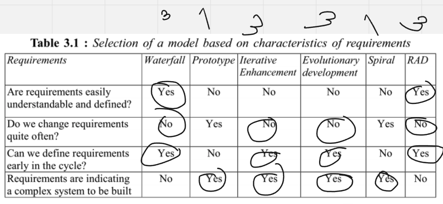

## Metodologia de Desenvolvimento

**Baseado no Framework de Gupta (2019), respondemos um conjunto de questões sobre os tópicos abordados pelo Framework para definir o modelo de desenvolvimento que será utilizado no projeto.**

### 1. Requisitos:

Figura 3 - Modelo Gupta para requisitos (fonte: Gupta, 2019)

| Pergunta                                                             | Nossa resposta |
| -------------------------------------------------------------------- | -------------- |
| Os requisitos são fáceis de entender e definir?                      | Sim            |
| Nós mudamos os requisitos com bastante frequência?                   | Não            |
| Nós podemos definir os requisitos ao início de cada ciclo?           | Sim            |
| Os requisitos estão indicando um sistema complexo para se construir? | Sim            |

Na conclusão do primeiro modelo de Gupta baseado nos requisitos, podemos perceber que o nosso projeto é complexo, porém, os requisitos são fáceis de entender e definir, e podemos definir os requisitos ao início de cada ciclo.

### 2. Equipe de Desenvolvimento:

Figura 4 - Modelo Gupta para equipe de desenvolvimento (fonte: Gupta, 2019)

| Pergunta                                               | Nossa resposta |
| ------------------------------------------------------ | -------------- |
| Pouca experienca em projetos similares                 | Não            |
| Pouca experiência em tecnologias similares             | Sim            |
| Pouca experiência com as ferramentas que serão usadas? | Não            |
| Disponibilidade para treinamento, se necessário        | Sim            |

Na conclusão do segundo modelo de Gupta baseado na equipe de desenvolvimento, podemos perceber que temos uma boa experiência em projetos similares, porém, temos pouca experiência em tecnologias similares, mas temos disponibilidade para treinamento, se necessário.

### 3. Usuários:

Figura 5 - Modelo Gupta para usuários (fonte: Gupta, 2019)

| Pergunta                                                                    | Nossa resposta |
| --------------------------------------------------------------------------- | -------------- |
| Envolvimento dos usuários                                                   | Sim            |
| Participação limitada dos usuários                                          | Não            |
| Usuário não tem experiência anterior em participação em projetos similares? | Não            |
| Usuário são especialistas no domínio do problema?                           | Sim            |

Na conclusão do terceiro modelo de Gupta baseado nos usuários, podemos perceber que temos um bom envolvimento dos usuários, e que os usuários são especialistas no domínio do problema.

### 4. Tipo de Projeto e Risco Associado:

Figura 6 - Modelo Gupta para tipo de projeto e risco associado (fonte: Gupta, 2019)

| Pergunta                                                   | Nossa resposta |
| ---------------------------------------------------------- | -------------- |
| O projeto é melhoria de um sistema existente?              | Sim            |
| O financiamento está estável para o projeto?               | Sim            |
| Requisitos de alta confiabilidade?                         | Não            |
| Cronograma do projeto é apertado?                          | Sim            |
| Uso de componentes reutilizáveis?                          | Sim            |
| Os recursos (Tempo, dinheiro, pessoas etc) estão escassos? | Não            |

Na conclusão do quarto modelo de Gupta baseado no tipo de projeto e risco associado, podemos perceber que o projeto é melhoria de um sistema existente, o financiamento está estável para o projeto, o cronograma do projeto é apertado e o uso de componentes reutilizáveis. 

Tendo em vista isso, a tabela abaixo apresenta o quadro de riscos assciado ao desenvolvimento do projeto.

| Risco                                                                               | Resolução                                                                                                                   |
| ----------------------------------------------------------------------------------- | --------------------------------------------------------------------------------------------------------------------------- |
| Falta de comunicação entre os membros da equipe                                     | Procurar saber o que está acontecendo com o membro envolvido, e estudar uma realocação de tarefas                           |
| Falta de comunicação com o cliente                                                  | Definir novos horários para as reuniões, ou até outras maneiras de se comunicar, como de forma assíncrona                   |
| Alterações de serviços externos (APIs de Bancos, por exemplo)                       | Adequar o produto o mais rápido possível de acordo com a nova documentação com as alterações realizadas                     |
| Falta de capacitação de um membro da equipe em relação a tecnologia sendo utilizada | O membro da equipe deve buscar ajuda de alguém que saiba, ou procurar por materiais e documentações para preencher a lacuna |

## Modelo do Processo de Desenvolvimento

Figura 7 - Procedimento do RAD ( Fonte: George Marsicano, 2023 )

Considerando todas as características do projeto, a equipe optou por utilizar o modelo RAD (Rapid Application Development), pois o projeto é de médio porte, com um prazo de entrega curto, a equipe tem experiência em projetos similares, e o projeto é uma melhoria de um sistema existente, o que facilita o desenvolvimento.A abordagem será hibrida com o modelo cascata para garantir a parte de levamento de requisitos e nas partes seguintes do desenvolvimento, o modelo RAD será utilizado.

## Ferramentas

Abaixo irei citar algumas das ferramentas que nossa equipe irá utilizar para o desenvolvimento do projeto.

| Ferramenta                               | Finalidade                             |
| ---------------------------------------- | -------------------------------------- |
| [Discord](https://discord.com/)          | Comunicação entre os membros da equipe |
| [Figma](https://www.figma.com/)          | Prototipação                           |
| [GitHub](https://github.com/)            | Repositório de código                  |
| [VSCode](https://code.visualstudio.com/) | Editor de código                       |
| [Whimsical](https://whimsical.com/)      | Fluxograma                             |

## Atividade RAD

A abordagem conhecida em português como Desenvolvimento Rápido de Aplicações, ou RAD, é um método incremental que direciona as atividades conforme ilustrado na Figura 10. Esse método abrange a criação de módulos que passam pelas etapas de análise, design, codificação e teste. Cada um desses módulos é construído por equipes dedicadas, operando em paralelo, com base nos requisitos identificados e divididos durante o ciclo de elicitação. Para alcançar esse objetivo, empregamos diversas técnicas e ferramentas de desenvolvimento.

O processo de desenvolvimento de software híbrido é uma abordagem que combina elementos de dois ou mais modelos, nossa abordagem vai combinar o modelo cascata com o modelo RAD onde o processo começa com uma fase de requisitos iniciais, que é realizada usando o modelo cascata. Nesta fase, os requisitos do software são coletados e documentados de forma completa e consistente.

Uma pessoa do grupo será responsável por essa tarefa. Essa pessoa será responsável por usar uma abordagem de elicitação de requisitos para entender as necessidades do cliente. Ela também será responsável por garantir que os requisitos sejam completos, consistentes e realizáveis.

Após a fase de requisitos iniciais, o processo muda para um modelo RAD. Nesta fase, o software é desenvolvido em ciclos iterativos e incrementais. Cada ciclo consiste em uma ou mais das etapas do processo de desenvolvimento de software, como análise, design, desenvolvimento, teste e entrega.

Para o projeto de software com os 5 membros, sugerimos que o grupo pode ser dividido em três times, com uma pessoa apenas para requisitos. Cada time seria responsável pelo desenvolvimento de um módulo específico do software.

O processo de desenvolvimento de software híbrido tem as seguintes vantagens:

- Flexibilidade: O modelo RAD permite que o software seja desenvolvido de forma iterativa e incremental, o que pode ser útil para projetos de software com requisitos mutáveis.
- Eficiência: O modelo cascata pode ser usado para garantir que os requisitos do software sejam completos e consistentes antes do desenvolvimento começar.
- Colaboração: A divisão do grupo em três times pode facilitar a colaboração e a comunicação.

**Vantagens da inclusão da pessoa nos requisitos**

A inclusão de uma pessoa responsável pelos requisitos no processo de desenvolvimento de software híbrido tem as seguintes vantagens:

- Garante que os requisitos sejam coletados e analisados com cuidado. A pessoa responsável pelos requisitos será capaz de se concentrar nessa tarefa e garantir que os requisitos sejam completos, consistentes e realizáveis.
- Aumenta a eficiência do processo. A pessoa responsável pelos requisitos pode trabalhar em paralelo com os outros times, o que pode ajudar a acelerar o desenvolvimento do software.
- Melhora a comunicação e a colaboração entre os times. A pessoa responsável pelos requisitos pode ser um ponto focal para a comunicação entre os times, o que pode ajudar a evitar erros e mal-entendidos.

No geral, o processo de desenvolvimento de software híbrido é uma boa opção para projetos de software com requisitos mutáveis e que precisam ser desenvolvidos de forma eficiente e colaborativa.

Aqui está uma explicação mais detalhada da imagem, com base no contexto fornecido:

**Requisitos:** Os requisitos do software são coletados e documentados usando o modelo cascata. Nesta fase, o grupo usa uma abordagem de elicitação de requisitos para entender as necessidades do cliente. Uma pessoa do grupo será responsável por essa tarefa.

**Análise:** Os requisitos são analisados para garantir que sejam completos, consistentes e realizáveis. Nesta fase, o grupo usa técnicas de análise de requisitos para identificar quaisquer problemas ou lacunas nos requisitos.

**Design:** O software é projetado usando o modelo RAD. Nesta fase, o grupo cria um modelo de arquitetura e especifica detalhes de implementação.

**Desenvolvimento:** O software é desenvolvido usando o modelo RAD. Nesta fase, o grupo divide o software em três módulos, com cada módulo sendo desenvolvido por um time.

**Teste:** O software é testado usando o modelo RAD. Nesta fase, o grupo testa cada módulo após ser desenvolvido.

**Entrega:** O software é entregue ao cliente.

A divisão do grupo em três times, com uma pessoa apenas para requisitos, é uma maneira de garantir que os requisitos do software sejam coletados e analisados com cuidado. A pessoa responsável pelos requisitos será capaz de se concentrar nessa tarefa e garantir que os requisitos sejam completos, consistentes e realizáveis.

| Time | Membros | Módulo responsável |
|---|---|---|
| **Requisitos** | Gustavo Kenzo | Requisitos |
| **Desenvolvimento 1** | Maicon Rodrigues, Gustavo Henrique, Maria Luisa | Módulo 1 (back-end) |
| **Desenvolvimento 2** | Bruno, Breno Yuri | Módulo 2 (front-end) |

A divisão foi feita de forma a balancear as habilidades e experiências dos membros da equipe. O time de requisitos é responsável por coletar, documentar e analisar os requisitos do software. O time de desenvolvimento 1 é responsável pelo desenvolvimento do módulo 1, que é um módulo de back-end.

**Justificativa da divisão**

**Requisitos:** Uma pessoa foi designada para liderar os esforços de elicitação de requisitos, Gustavo Kenzo. Ele terá a oportunidade de se concentrar nessa tarefa e garantir que os requisitos sejam completos, consistentes e realizáveis.
**Desenvolvimento 1:** Maicon Rodrigues, Gustavo Henrique e Maria Luisa têm experiência em desenvolvimento de software. Eles serão responsáveis pelo desenvolvimento do módulo 1, que é um módulo de back-end.
**Desenvolvimento 2:** Bruno e Breno Yuri têm experiência em desenvolvimento de front-end. Eles serão responsáveis pelo desenvolvimento do módulo 2, que é um módulo de front-end.

Figura 8 - Modelo de trabalho do RAD (fonte: _Software Engineering | Rapid application development model_, 2023)

##  Processos e Procedimentos

### 1. Escolhas do Processo de Engenharia de Requisitos

Figura 9 - Faceta da engenharia de requisitos (fonte: MARSICANO, 2023)

Tendo em vista os fundamentos nas Facetas do Procedimento de Engenharia de Requisitos (IREB, 2022), estabeleceu-se que se no presente projeto trataremos de um procedimento voltado para o cliente, haja vista que:

1. Prooduto com enfâse ao cliente
2. Processo exploratório ;
3. Tempo interativo.

#### 2. Atividades do Processo de Engenharia de Requisitos

Como equipe de desenvolvimento de software, nos comprometemos a seguir as seguintes atividades no processo de engenharia de requisitos:

| Etapa                                 | Descrição                                                                                                                                                                   |
|---------------------------------------|----------------------------------------------------------------------------------------------------------------------------------------------------------------------------|
| **Viabilidade**                       | 1. Realizar um estudo de viabilidade para avaliar a pertinência do sistema para a empresa.                                                                                  |
| **Descoberta e Análise de Requisitos** | 2. Realizar entrevistas com os usuários a fim de identificar suas necessidades. 3. Conduzir reuniões com as partes interessadas para compreender as necessidades do negócio. 4. Analisar documentos para identificar os requisitos do sistema. |
| **Especificação de Requisitos**        | 5. Especificar os requisitos do sistema por meio de um modelo, diagrama ou documento escrito.                                                                               |
| **Validação de Requisitos**            | 6. Obter feedback dos usuários em relação aos requisitos do sistema. 7. Realizar testes para validar os requisitos do sistema.           |

As atividades do processo de engenharia de requisitos serão repetidas várias vezes à medida que o sistema é desenvolvido. 

##  Requisitos e Planejamento

| Atividade                                                                                | Técnica     | Entrega                                                                                                                                                                |
| ---------------------------------------------------------------------------------------- | ------------- | --------------------------------------------------------------------------------------------------------------------------------------------------------------------------------------------- |
| Elicitação e Descorberta                                                                | Diagrama de Ishikawa       | 	Backlog de requisitos                                                                              |
| Análise e Consenso                                     | Análise de Viabilidade       | Backlog de requisitos                                                |
| Declaração                                                                         | User Stories, Temas, Casos de Uso       | User Stories   |
| Representação                                                               | Prototipagem           | Protótipos |
| Verificação e Validação                                                              | Feedback           | Retorno de Feedback             |
| Organização e Atualização                                                               | MoSCoW | Definição de  prioridades     |
