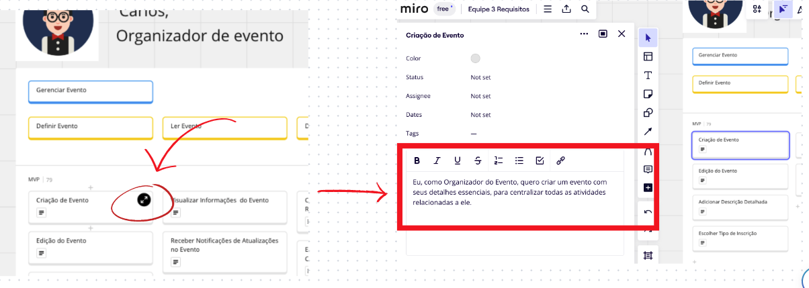

## User Stories Mapping - ComunEventos

A empresa ComunEventos foi analisada pelo grupo para a criação de um USM. Onde identificamos as Personas, compreendendo as suas atividades e objetivos. Em seguida, foi elaborado o MVP e definido as User Stories (US).

Abaixo segue as imagens referentes a cada um das nossas personas:

 

No total foram produzidos 79 US, sendo inviavel estruturar isso em uma tabela, abaixo é disponibilizado o frame do USM.

<iframe width="768" height="432" src="https://miro.com/app/board/uXjVNCiZTAA=/" frameborder="0" scrolling="no" allow="fullscreen; clipboard-read; clipboard-write" allowfullscreen></iframe>

Para vizualização das US, basta expandir os card's de acordo com o tutorial da imagem abaixo: 

Deixamos a Ultima modificação do arquivo clara para comprovar que não existe fralde, sendo possivel comprovar tambem pelo tutorial abaixo.

