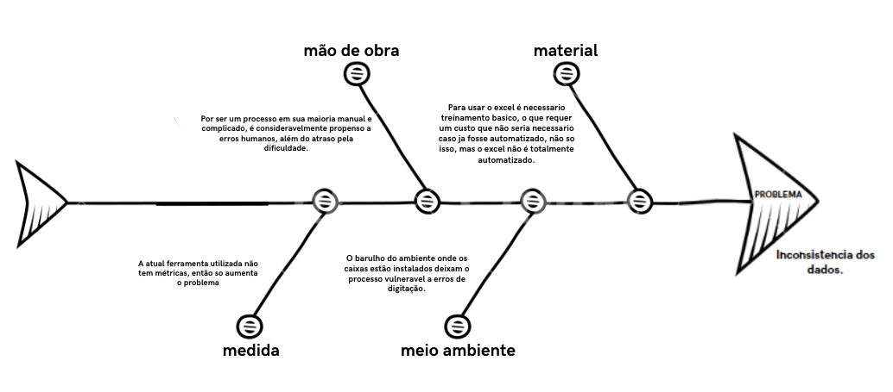
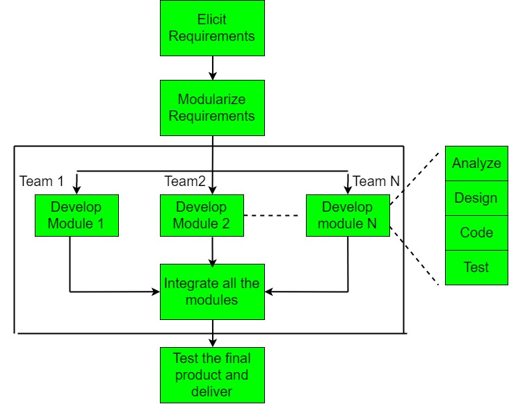
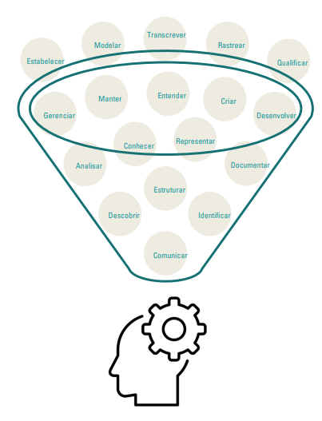

# VISÃO DO PRODUTO E PROJETO

## 1. VISÃO GERAL DO PRODUTO

### 1.1 Problema

O problema em questão envolve a gestão do fluxo de caixa nas lojas da empresa. Atualmente, o sistema utilizado é chamado de Gladium, que é usado para fazer emissão de notas fiscais, mas que não faz o controle dos pagamentos a prazo. O controle das vendas a prazo é feito no excel pelo setor financeiro da empresa, ficando como responsabilidade dos caixas informar quais vendas foram a prazo ao setor. Todo esse processo exige uma mão de obra que necessita de um treinamento adequado dos funcionários para identificar e registrar tais pagamentos no Excel, além de ser suscetível a erros de comunicação, resultando em informações imprecisas. Além disso, há a falta de um sistema automatizado para importar informações de pix/transferências bancárias de maneira integrada ao sistema utilizado atualmente pela empresa, o que pode incorrer em erros de transcrição. Tais erros foram, inclusive, notados pela cliente durante o processo de explicação do problema ao consultar algumas das planilhas. Diante disso, vemos uma clara dependência excessiva de processos manuais para registrar os pagamentos a prazo às vendas/cobranças. Toda essa falta de uma estrutura organizacional eficiente para armazenar os extratos bancários e documentos relacionados aos pagamentos, aliado a erros que possam ser provenientes do ambiente de trabalho, tal como distrações durante o processo, além da falta de sistemas de verificação de erros para garantir a precisão desses dados registrados no Excel, tornam todo o trabalho suscetível a erros, como os relatados pela cliente.

Figura 1 - Diagrama de Ishikawa

### 1.2 Declaração de Posição do Produto

| Para          | comerciantes                                                                                                                                                                                                                                                                                                                                                        |
| ------------- | ------------------------------------------------------------------------------------------------------------------------------------------------------------------------------------------------------------------------------------------------------------------------------------------------------------------------------------------------------------------- |
| Quem          | que precisam de uma forma de gerenciar o fluxo dos caixas das lojas de diversos meios de pagamento                                                                                                                                                                                                                                                                  |
| O Tabeçai     | é uma aplicação web de dashboard que serve como organizador e agregador de transações                                                                                                                                                                                                                                                                               |
| Que           | faz o controle de vendas tanto a vista quanto a prazo de maneira integrada com os caixas, a fim de melhorar a comunicação com o setor financeiro da empresa, assim produzindo resultados confiáveis e de maneira eficiente                                                                                                                                          |
| Ao contrário  | do sistema atualmente usado na empresa, chamado Gladium, que é uma plataforma para fazer as vendas (emissão de notas fiscais)                                                                                                                                                                                                                                       |
| Nosso produto | Consegue fazer o controle de pagamentos feitos a prazo, além de tirar o processo manual de transcrever as informações de pix e de transferências recebidas dos extratos bancários. Podendo também atrelar determinado pix à venda/cobrança informado pelo caixa, e produzir informações úteis sobre os resultados financeiros do dia ou de algum intervalo de tempo |

### 1.3 Objetivos do Produto

O objetivo do desenvolvimento deste produto é automatizar a administração do fluxo de caixa de todas as lojas, a fim de gerar resultados confiáveis, sem ter a necessidade do setor financeiro perder tempo checando transação por transação se os valores estão corretos ou não. O atual processo manual de registro de transações em planilhas, que demonstrou ser propenso a erros, será substituído por um sistema automatizado, fornecendo uma solução de software que otimize o gerenciamento do fluxo de caixa, minimizando erros, economizando tempo e recursos e proporcionando maior segurança nas operações financeiras das lojas em questão.

## 2. VISÃO GERAL DO PROJETO

### 2.1 Organização do Projeto

| **Papel**                       | **Atribuições**                                                                                                                                                         | **Responsável** | **Participantes**                                   |
| :------------------------------ | :---------------------------------------------------------------------------------------------------------------------------------------------------------------------- | :-------------- | :-------------------------------------------------- |
| Pessoa Desenvolvedora           | Codificar o produto, realizar refatoração, testar, configurar, versionar, evoluir, integrar, documentar, ata das reuniões, estratégia de código                         | Gustavo Kenzo   | Breno, Bruno, Gustavo Henrique, Maicon, Maria Luisa |
| Líder do Time                   | Delegar tarefas, duração do Ciclo, organização das atividades, one-to-one com os membros, estratégia de produto                                                         | Maria Luísa     | Gustavo Kenzo, Gustavo Henrique                     |
| Pessoa Engenheira de Requisitos | Descobrir, elicitar, analisar, consensuar, declarar, representar, organizar e atualizar requisitos                                                                      | Maria Luísa     | Breno, Bruno, Gustavo Kenzo, Maicon, Maria Luisa    |
| Cliente                         | Fornecer insumos para requisitos, fornecer feedbacks sobre os produtos, priorizar requisitos                                                                            | Gustavo Kenzo   | Elizabete                                           |
| Monitora                        | Verificar requisitos, fornecer feedbacks sobre o processo de ER, auxiliar em dúvidas da equipe acerca da disciplina de requisitos, articular os interesses do professor | Bruno           | Sabrina                                             |

### 2.2 Matriz de Comunicação

| Descrição                       | Área/Envolvidos               | Periodicidade | Produtos Gerados                                                                                      |
| :------------------------------ | :---------------------------- | :------------ | :---------------------------------------------------------------------------------------------------- |
| Acompanhamento Diário           | Equipe do Projeto             | Diário        | Relato por parte dos membros da equipe no WhatsApp sobre o andamento individual das partes do projeto |
| Acompanhamento de Ciclo         | Equipe do Projeto e Monitor   | Semanal       | Ata da Reunião, Relação de Feedbacks sobre as entregas do produto                                     |
| Comunicar a situação do projeto | Equipe do Projeto e Professor | Mensalmente   | Artefatos solicitados, Relação de Feedbacks do Professor                                              |

### 2.3 Planejamento das Fases e/ou Iterações do Projeto

| Sprint   | Produto (Entrega)                                                                                                                                                                                    | Data de Início | Data de Fim |
| -------- | ---------------------------------------------------------------------------------------------------------------------------------------------------------------------------------------------------- | -------------- | ----------- |
| Sprint 1 | - Definição do produto;  - Definição do Problema;  - Início do GitPages;  -Conclusão da ideia do produto;  -Produção da Visão do Produto e Projeto;                                 | 14/09/2023     | 28/09/2023  |
| Sprint 2 | -Criação da Versão Inicial do Backlog do Produto;  -Definição das Histórias de Usuário  -Definição de tecnologias utilizadas no Projeto;  -Produção do protótipo de baixa fidelidade. | 29/09/2023     | 13/10/2023  |
| Sprint 3 | -Validação e Verificação de Requisitos  -Levantamento de escorpo do MVP1 E MVP2  -Inicializar Front-end, pós validação do cliente                                                           | 14/10/2023     | 26/10/2023  |
| Sprint 4 |                                                                                                                                                                                                      | 27/10/2023     | 09/11/2023  |
| Sprint 5 |                                                                                                                                                                                                      | 10/11/2023     | 24/11/2023  |
| Sprint 6 |                                                                                                                                                                                                      | 25/11/2023     | 09/12/2023  |
| Sprint 7 |                                                                                                                                                                                                      | 09/12/2023     | 14/12/2023  |

## 3. Metodologia de Desenvolvimento

**Baseado no Framework de Gupta (2019), respondemos um conjunto de questões sobre os tópicos abordados pelo Framework para definir o modelo de desenvolvimento que será utilizado no projeto.**

### 3.1 Requisitos:

Figura 3 - Modelo Gupta para requisitos (fonte: Gupta, 2019)

| Pergunta                                                             | Nossa resposta |
| -------------------------------------------------------------------- | -------------- |
| Os requisitos são fáceis de entender e definir?                      | Sim            |
| Nós mudamos os requisitos com bastante frequência?                   | Não            |
| Nós podemos definir os requisitos ao início de cada ciclo?           | Sim            |
| Os requisitos estão indicando um sistema complexo para se construir? | Sim            |

Na conclusão do primeiro modelo de Gupta baseado nos requisitos, podemos perceber que o nosso projeto é complexo, porém, os requisitos são fáceis de entender e definir, e podemos definir os requisitos ao início de cada ciclo.

### 3.2 Equipe de Desenvolvimento:

Figura 4 - Modelo Gupta para equipe de desenvolvimento (fonte: Gupta, 2019)

| Pergunta                                               | Nossa resposta |
| ------------------------------------------------------ | -------------- |
| Pouca experienca em projetos similares                 | Não            |
| Pouca experiência em tecnologias similares             | Sim            |
| Pouca experiência com as ferramentas que serão usadas? | Não            |
| Disponibilidade para treinamento, se necessário        | Sim            |

Na conclusão do segundo modelo de Gupta baseado na equipe de desenvolvimento, podemos perceber que temos uma boa experiência em projetos similares, porém, temos pouca experiência em tecnologias similares, mas temos disponibilidade para treinamento, se necessário.

### 3.3 Usuários:

Figura 5 - Modelo Gupta para usuários (fonte: Gupta, 2019)

| Pergunta                                                                    | Nossa resposta |
| --------------------------------------------------------------------------- | -------------- |
| Envolvimento dos usuários                                                   | Sim            |
| Participação limitada dos usuários                                          | Não            |
| Usuário não tem experiência anterior em participação em projetos similares? | Não            |
| Usuário são especialistas no domínio do problema?                           | Sim            |

Na conclusão do terceiro modelo de Gupta baseado nos usuários, podemos perceber que temos um bom envolvimento dos usuários, e que os usuários são especialistas no domínio do problema.

### 3.4 Tipo de Projeto e Risco Associado:

Figura 6 - Modelo Gupta para tipo de projeto e risco associado (fonte: Gupta, 2019)

| Pergunta                                                   | Nossa resposta |
| ---------------------------------------------------------- | -------------- |
| O projeto é melhoria de um sistema existente?              | Sim            |
| O financiamento está estável para o projeto?               | Sim            |
| Requisitos de alta confiabilidade?                         | Não            |
| Cronograma do projeto é apertado?                          | Sim            |
| Uso de componentes reutilizáveis?                          | Sim            |
| Os recursos (Tempo, dinheiro, pessoas etc) estão escassos? | Não            |

Na conclusão do quarto modelo de Gupta baseado no tipo de projeto e risco associado, podemos perceber que o projeto é melhoria de um sistema existente, o financiamento está estável para o projeto, o cronograma do projeto é apertado e o uso de componentes reutilizáveis.

#### 3.4.1 Riscos

| Risco                                                                               | Resolução                                                                                                                   |
| ----------------------------------------------------------------------------------- | --------------------------------------------------------------------------------------------------------------------------- |
| Falta de comunicação entre os membros da equipe                                     | Procurar saber o que está acontecendo com o membro envolvido, e estudar uma realocação de tarefas                           |
| Falta de comunicação com o cliente                                                  | Definir novos horários para as reuniões, ou até outras maneiras de se comunicar, como de forma assíncrona                   |
| Alterações de serviços externos (APIs de Bancos, por exemplo)                       | Adequar o produto o mais rápido possível de acordo com a nova documentação com as alterações realizadas                     |
| Falta de capacitação de um membro da equipe em relação a tecnologia sendo utilizada | O membro da equipe deve buscar ajuda de alguém que saiba, ou procurar por materiais e documentações para preencher a lacuna |

### 3.5 Escolha do Modelo do Processo de Desenvolvimento

Figura 7 - Procedimento do RAD ( Fonte: George Marsicano, 2023 )

Considerando todas as características do projeto, a equipe optou por utilizar o modelo RAD (Rapid Application Development), pois o projeto é de médio porte, com um prazo de entrega curto, a equipe tem experiência em projetos similares, e o projeto é uma melhoria de um sistema existente, o que facilita o desenvolvimento.A abordagem será hibrida com o modelo cascata para garantir a parte de levamento de requisitos e nas partes seguintes do desenvolvimento, o modelo RAD será utilizado.

### 3.6 Ferramentas

Abaixo irei citar algumas das ferramentas que nossa equipe irá utilizar para o desenvolvimento do projeto.

| Ferramenta                               | Finalidade                             |
| ---------------------------------------- | -------------------------------------- |
| [Discord](https://discord.com/)          | Comunicação entre os membros da equipe |
| [Figma](https://www.figma.com/)          | Prototipação                           |
| [GitHub](https://github.com/)            | Repositório de código                  |
| [VSCode](https://code.visualstudio.com/) | Editor de código                       |
| [Whimsical](https://whimsical.com/)      | Fluxograma                             |

### 3.7 Atividade RAD

A abordagem conhecida em português como Desenvolvimento Rápido de Aplicações, ou RAD, é um método incremental que direciona as atividades conforme ilustrado na Figura 10. Esse método abrange a criação de módulos que passam pelas etapas de análise, design, codificação e teste. Cada um desses módulos é construído por equipes dedicadas, operando em paralelo, com base nos requisitos identificados e divididos durante o ciclo de elicitação. Para alcançar esse objetivo, empregamos diversas técnicas e ferramentas de desenvolvimento.

A premissa subjacente é que, ao integrar esses módulos, conseguimos testar e entregar o produto final. No nosso caso, optamos por adotar uma abordagem híbrida. Inicialmente, utilizamos uma abordagem em cascata para os requisitos iniciais que identificamos. Posteriormente, nas fases subsequentes, incorporamos abordagens ágeis e o processo RAD em sua totalidade. Consequentemente, distribuiremos nossos cinco membros em dois times que trabalharão simultaneamente em módulos distintos.

Figura 10 - Modelo de trabalho do RAD (fonte: _Software Engineering | Rapid application development model_, 2023)

### 3.8 Processos e Procedimentos

#### 3.8.1 Escolhas do Processo de Engenharia de Requisitos

Figura 8 - Faceta da engenharia de requisitos (fonte: MARSICANO, 2023)

Tendo em vista os fundamentos nas Facetas do Procedimento de Engenharia de Requisitos (IREB, 2022), estabeleceu-se que se no presente projeto trataremos de um procedimento voltado para o cliente, haja vista que:

1. Prooduto com enfâse ao cliente
2. Processo exploratório ;
3. Tempo interativo.

#### 3.8.2 Atividades do Processo de Engenharia de Requisitos

Planejamos começar com a avaliação da utilidade do sistema para a empresa (conhecida como estudo de viabilidade), seguida pela descoberta e análise dos requisitos, a transformação deles em uma forma padronizada (especificação) e, finalmente, a verificação para garantir que os requisitos definidos realmente atendem às necessidades do cliente (validação). No entanto, na prática, a engenharia de requisitos é um processo iterativo, onde essas atividades se entrelaçam ao longo do tempo.

Figura 9 - Atividades da Engenharia de Requisitos (fonte: Marsicano, 2023)

#### 3.8.3 Requisitos e Planejamento

No processo de seleção de um ciclo de vida híbrido, foi fundamental identificar os processos específicos a serem utilizados em cada fase do projeto. Neste caso, consideramos a combinação de elementos do modelo em cascata com o modelo de desenvolvimento rápido (RAD) para maximizar a eficiência e a adaptabilidade.

A Engenharia de Requisitos desempenha um papel crucial nesse contexto, pois a compreensão completa e precisa dos requisitos do projeto é fundamental para guiar as decisões de desenvolvimento. A seguir, apresentamos uma tabela que descreve as fases e atividades de um modelo híbrido que começa com o ciclo de vida em cascata e transita para o modelo RAD:

| Fase                         | Abordagem     | Atividade                                                                                | Atividades a ser desenvolvida                                                                                                                                                                 |
| ---------------------------- | ------------- | ---------------------------------------------------------------------------------------- | --------------------------------------------------------------------------------------------------------------------------------------------------------------------------------------------- |
| 1. Planejamento Inicial      | Cascata       | -Elicitação e Descorberta                                                                | - Definição de objetivos do projeto   - Coleta de requisitos   - Estabelecimento de plano de projeto                                                                                |
| 2. Análise                   | Cascata       | -Análise e Consenso   -Elicitação e Descorberta                                     | - Análise detalhada de requisitos  - Especificação de requisitos funcionais e não funcionais  - Documentação completa de requisitos                                                 |
| 3. Design                    | Cascata       | - Representação                                                                          | - Criação de documentação de design   - Projeto de arquitetura do sistema  - Projeto de interface do usuário (baixa fidelidade)   - Especificação de componentes de software   |
| 4. Desenvolvimento Iterativo | RAD           | - Verificaçnao e Validação                                                               | - Desenvolvimento rápido de protótipos ou versões iniciais do software   - Feedback constante dos stakeholders para refinamento   - Iterações frequentes de desenvolvimento e teste |
| 5. Integração                | RAD           | - Verificaçnao e Validação                                                               | - Integração dos componentes desenvolvidos nas iterações anteriores   - Testes de integração contínuos  - Garantia de que as partes do sistema funcionem bem juntas                 |
| 6. Teste e Qualidade         | Cascata e RAD | - Verificaçnao e Validação                                                               | - Teste de unidade, teste de integração e teste do sistema (Cascata)  - Testes adicionais de aceitação do usuário e teste de desempenho (RAD)   - Correção de bugs (RAD)            |
| 7. Implantação               | Cascata       | - Representação formal   - Verificação e validação   Organização e Atualização | - Preparação para a implantação do sistema   - Treinamento de usuários finais   - Implantação final do sistema em ambiente de produção                                              |

## Referências

LAPLANTE, Phillip A. Requirements Engineering for Software and Systems. 3ª edição. Auerbach Publications, 2017.

MARSICANO, George. Centro de Estudos, Desenvolvimento e Inovação em Software (CEDI). Disponível em: https://www.cedis.unb.br.

## Histórico de Versão

| Data       | Versão | Modificação                                                           | Autor                                                              |
| :--------- | :----- | :-------------------------------------------------------------------- | :----------------------------------------------------------------- |
| 26/09/2023 | 1.0    | Criação do documento                                                  | Breno, Bruno, Gustavo Kenzo, Gustavo Henrique, Maicon, Maria Luisa |
| 26/09/2023 | 1.1    | Adição da visão geral do produto, desenvolvimento do projeto e assets | Gustavo Kenzo, Gustavo Henrique, Bruno                             |
| 27/09/2023 | 1.2    | Inicialização do tópico de Processos e Procedimentos                  | Breno Yuri, Maria Luisa                                            |

## Tecnologias

| Tecnologia                              | Função                                                 |
| :-------------------------------------- | :----------------------------------------------------- |
| [React](https://pt-br.reactjs.org/)     | Biblioteca JavaScript para criar interfaces de usuário |
| [Next.js](https://nextjs.org/)          | Framework React                                        |
| [Node.js](https://nodejs.org/en/)       | Ambiente de execução JavaScript                        |
| [Prisma](https://www.prisma.io/)        | Modelagem para banco de dados                          |
| [Express](https://expressjs.com/pt-br/) | Framework para aplicativo da web do Node.js            |
| [TailwindCSS](https://tailwindcss.com/) | Framework CSS                                          |
