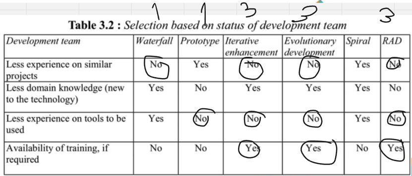

# VISÃO DO PRODUTO E PROJETO

## 1. VISÃO GERAL DO PRODUTO

### 1.1 Problema

O problema em questão envolve a gestão do fluxo de caixa nas lojas da empresa Natural Brasil, devido a deficiências no sistema atual (Gladium). Ele emite notas fiscais, mas não controla pagamentos a prazo. O controle é manual, feito no Excel, sujeito a erros de comunicação e exigindo treinamento para os funcionários. Além disso, a falta de integração para importar dados de pix/transferências bancárias pode causar erros. Isso resultou em imprecisões notadas pela cliente ao revisar planilhas. A empresa depende muito de processos manuais, carece de uma estrutura organizacional eficiente para arquivar documentos e extratos bancários, e não possui sistemas de verificação de erros. Isso torna o trabalho propenso a erros, como destacado pela cliente.

Figura 1 - Diagrama de Ishikawa

### 1.2 Declaração de Posição do Produto

| Para          | comerciantes                                                                                                                                                                                                                                                                                                                                                        |
| ------------- | ------------------------------------------------------------------------------------------------------------------------------------------------------------------------------------------------------------------------------------------------------------------------------------------------------------------------------------------------------------------- |
| Quem          | que precisam de uma forma de gerenciar o fluxo dos caixas das lojas de diversos meios de pagamento                                                                                                                                                                                                                                                                  |
| O Tabeçai     | é uma aplicação web de dashboard que serve como organizador e agregador de transações                                                                                                                                                                                                                                                                               |
| Que           | faz o controle de vendas tanto a vista quanto a prazo de maneira integrada com os caixas, a fim de melhorar a comunicação com o setor financeiro da empresa, assim produzindo resultados confiáveis e de maneira eficiente                                                                                                                                          |
| Ao contrário  | do sistema atualmente usado na empresa, chamado Gladium, que é uma plataforma para fazer as vendas (emissão de notas fiscais)                                                                                                                                                                                                                                       |
| Nosso produto | Consegue fazer o controle de pagamentos feitos a prazo, além de tirar o processo manual de transcrever as informações de pix e de transferências recebidas dos extratos bancários. Podendo também atrelar determinado pix à venda/cobrança informado pelo caixa, e produzir informações úteis sobre os resultados financeiros do dia ou de algum intervalo de tempo |

### 1.3 Objetivos do Produto

O objetivo do desenvolvimento deste produto é automatizar a administração do fluxo de caixa de todas as lojas, a fim de gerar resultados confiáveis, sem ter a necessidade do setor financeiro perder tempo checando transação por transação se os valores estão corretos ou não. O atual processo manual de registro de transações em planilhas, que demonstrou ser propenso a erros, será substituído por um sistema automatizado, fornecendo uma solução de software que otimize o gerenciamento do fluxo de caixa, minimizando erros, economizando tempo e recursos e proporcionando maior segurança nas operações financeiras das lojas em questão.

## 2. VISÃO GERAL DO PROJETO

### 2.1 Organização do Projeto

| **Papel**                       | **Atribuições**                                                                                                                                                         | **Responsável** | **Participantes**                                   |
| :------------------------------ | :---------------------------------------------------------------------------------------------------------------------------------------------------------------------- | :-------------- | :-------------------------------------------------- |
| Pessoa Desenvolvedora           | Codificar o produto, realizar refatoração, testar, configurar, versionar, evoluir, integrar, documentar, ata das reuniões, estratégia de código                         | Gustavo Kenzo   | Breno, Bruno, Gustavo Henrique, Maicon, Maria Luisa |
| Líder do Time                   | Delegar tarefas, duração do Ciclo, organização das atividades, one-to-one com os membros, estratégia de produto                                                         | Maria Luísa     | Gustavo Kenzo, Gustavo Henrique                     |
| Pessoa Engenheira de Requisitos | Descobrir, elicitar, analisar, consensuar, declarar, representar, organizar e atualizar requisitos                                                                      | Maria Luísa     | Breno, Bruno, Gustavo Kenzo, Maicon, Maria Luisa    |
| Cliente                         | Fornecer insumos para requisitos, fornecer feedbacks sobre os produtos, priorizar requisitos                                                                            | Gustavo Kenzo   | Elizabete                                           |
| Monitora                        | Verificar requisitos, fornecer feedbacks sobre o processo de ER, auxiliar em dúvidas da equipe acerca da disciplina de requisitos, articular os interesses do professor | Bruno           | Sabrina                                             |

### 2.2 Matriz de Comunicação

| Descrição                       | Área/Envolvidos               | Periodicidade | Produtos Gerados                                                                                      |
| :------------------------------ | :---------------------------- | :------------ | :---------------------------------------------------------------------------------------------------- |
| Acompanhamento Diário           | Equipe do Projeto             | Diário        | Relato por parte dos membros da equipe no WhatsApp sobre o andamento individual das partes do projeto |
| Acompanhamento de Ciclo         | Equipe do Projeto e Monitor   | Semanal       | Ata da Reunião, Relação de Feedbacks sobre as entregas do produto                                     |
| Comunicar a situação do projeto | Equipe do Projeto e Professor | Mensalmente   | Artefatos solicitados, Relação de Feedbacks do Professor                                              |

### 2.3 Planejamento das Fases e/ou Iterações do Projeto

| Sprint   | Produto (Entrega)                                            | Data de Início | Data de Fim |
| -------- | ------------------------------------------------------------ | -------------- | ----------- |
| Sprint 1 | - Definição do produto;  - Definição do Problema;  - Início do GitPages;  -Conclusão da ideia do produto;  -Produção da Visão do Produto e Projeto; | 14/09/2023     | 28/09/2023  |
| Sprint 2 | -Criação da Versão Inicial do Backlog do Produto;  -Definição das Histórias de Usuário  -Definição de tecnologias utilizadas no Projeto;  -Produção do protótipo de baixa fidelidade. | 29/09/2023     | 13/10/2023  |
| Sprint 3 | -Validação e Verificação de Requisitos  -Levantamento de escorpo do MVP1 E MVP2  -Inicializar Front-end, pós validação do cliente | 14/10/2023     | 26/10/2023  |
| Sprint 4 | MVP 1 US01; US02; US03; US04; US07; US08; US09; US10; US17; US19; US21; US23; US24; US25; US26; US27; US28; US29. | 27/10/2023     | 09/11/2023  |
| Sprint 5 | Revisão e correção de bugs MVP1, espaço para resolução de transbordamento. | 10/11/2023     | 24/11/2023  |
| Sprint 6 | MVP 2 US05; US06; US11; US12; US13; US14; US15; US16; US18; US20; US22. | 25/11/2023     | 09/12/2023  |
| Sprint 7 | Revisão e correção de bugs MVP2, espaço para resolução de transbordamento. | 09/12/2023     | 14/12/2023  |

### 2.4 Critérios de Replanejamento

O Replanejamento é uma etapa crucial para garantir que o projeto permaneça ágil e flexível. Os critérios de replanejamento indicam quando e por que você deve revisar e ajustar o plano do projeto ou a abordagem do RAD.

* Mudanças nos Requisitos do Cliente: Quando os requisitos do cliente mudam, o replanejamento é necessário para acomodar essas mudanças. Isso pode ser causado por novas informações, feedback do cliente ou evolução dos objetivos do projeto.

* Problemas Técnicos Inesperados: Se surgirem problemas técnicos imprevistos durante o desenvolvimento que afetem a estimativa de tempo ou recursos, ex: trancamento da disciplina, pode ser necessário replanejar o projeto para lidar com esses problemas.

* Feedback do Usuário: O feedback dos usuários pode revelar deficiências ou melhorias necessárias no sistema. O replanejamento pode ser acionado para incorporar essas sugestões.

* Restrições de Tempo: Se as restrições de tempo forem mais apertadas do que o previsto, o replanejamento pode ser necessário para priorizar as funcionalidades essenciais e fazer ajustes para atender aos prazos.

## 3. Metodologia de Desenvolvimento

**Baseado no Framework de Gupta (2019), respondemos um conjunto de questões sobre os tópicos abordados pelo Framework para definir o modelo de desenvolvimento que será utilizado no projeto.**

### 3.1 Requisitos:

Figura 3 - Modelo Gupta para requisitos (fonte: Gupta, 2019)

| Pergunta                                                             | Nossa resposta |
| -------------------------------------------------------------------- | -------------- |
| Os requisitos são fáceis de entender e definir?                      | Sim            |
| Nós mudamos os requisitos com bastante frequência?                   | Não            |
| Nós podemos definir os requisitos ao início de cada ciclo?           | Sim            |
| Os requisitos estão indicando um sistema complexo para se construir? | Sim            |

Na conclusão do primeiro modelo de Gupta baseado nos requisitos, podemos perceber que o nosso projeto é complexo, porém, os requisitos são fáceis de entender e definir, e podemos definir os requisitos ao início de cada ciclo.

### 3.2 Equipe de Desenvolvimento:

Figura 4 - Modelo Gupta para equipe de desenvolvimento (fonte: Gupta, 2019)

| Pergunta                                               | Nossa resposta |
| ------------------------------------------------------ | -------------- |
| Pouca experienca em projetos similares                 | Não            |
| Pouca experiência em tecnologias similares             | Sim            |
| Pouca experiência com as ferramentas que serão usadas? | Não            |
| Disponibilidade para treinamento, se necessário        | Sim            |

Na conclusão do segundo modelo de Gupta baseado na equipe de desenvolvimento, podemos perceber que temos uma boa experiência em projetos similares, porém, temos pouca experiência em tecnologias similares, mas temos disponibilidade para treinamento, se necessário.

### 3.3 Usuários:

Figura 5 - Modelo Gupta para usuários (fonte: Gupta, 2019)

| Pergunta                                                                    | Nossa resposta |
| --------------------------------------------------------------------------- | -------------- |
| Envolvimento dos usuários                                                   | Sim            |
| Participação limitada dos usuários                                          | Não            |
| Usuário não tem experiência anterior em participação em projetos similares? | Não            |
| Usuário são especialistas no domínio do problema?                           | Sim            |

Na conclusão do terceiro modelo de Gupta baseado nos usuários, podemos perceber que temos um bom envolvimento dos usuários, e que os usuários são especialistas no domínio do problema.

### 3.4 Tipo de Projeto e Risco Associado:

Figura 6 - Modelo Gupta para tipo de projeto e risco associado (fonte: Gupta, 2019)

| Pergunta                                                   | Nossa resposta |
| ---------------------------------------------------------- | -------------- |
| O projeto é melhoria de um sistema existente?              | Sim            |
| O financiamento está estável para o projeto?               | Sim            |
| Requisitos de alta confiabilidade?                         | Não            |
| Cronograma do projeto é apertado?                          | Sim            |
| Uso de componentes reutilizáveis?                          | Sim            |
| Os recursos (Tempo, dinheiro, pessoas etc) estão escassos? | Não            |

Na conclusão do quarto modelo de Gupta baseado no tipo de projeto e risco associado, podemos perceber que o projeto é melhoria de um sistema existente, o financiamento está estável para o projeto, o cronograma do projeto é apertado e o uso de componentes reutilizáveis.

#### 3.4.1 Riscos

| Risco                                                                               | Resolução                                                                                                                   |
| ----------------------------------------------------------------------------------- | --------------------------------------------------------------------------------------------------------------------------- |
| Falta de comunicação entre os membros da equipe                                     | Procurar saber o que está acontecendo com o membro envolvido, e estudar uma realocação de tarefas                           |
| Falta de comunicação com o cliente                                                  | Definir novos horários para as reuniões, ou até outras maneiras de se comunicar, como de forma assíncrona                   |
| Alterações de serviços externos (APIs de Bancos, por exemplo)                       | Adequar o produto o mais rápido possível de acordo com a nova documentação com as alterações realizadas                     |
| Falta de capacitação de um membro da equipe em relação a tecnologia sendo utilizada | O membro da equipe deve buscar ajuda de alguém que saiba, ou procurar por materiais e documentações para preencher a lacuna |

### 3.5 Escolha do Modelo do Processo de Desenvolvimento

Figura 7 - Procedimento do RAD ( Fonte: George Marsicano, 2023 )

Considerando todas as características do projeto, a equipe optou por utilizar o modelo RAD (Rapid Application Development), pois o projeto é de médio porte, com um prazo de entrega curto, a equipe tem experiência em projetos similares, e o projeto é uma melhoria de um sistema existente, o que facilita o desenvolvimento.A abordagem será hibrida com o modelo cascata para garantir a parte de levamento de requisitos e nas partes seguintes do desenvolvimento, o modelo RAD será utilizado.

### 3.6 Ferramentas

Abaixo irei citar algumas das ferramentas que nossa equipe irá utilizar para o desenvolvimento do projeto.

| Ferramenta                               | Finalidade                             |
| ---------------------------------------- | -------------------------------------- |
| [Discord](https://discord.com/)          | Comunicação entre os membros da equipe |
| [Figma](https://www.figma.com/)          | Prototipação                           |
| [GitHub](https://github.com/)            | Repositório de código                  |
| [VSCode](https://code.visualstudio.com/) | Editor de código                       |
| [Whimsical](https://whimsical.com/)      | Fluxograma                             |

### 3.7 Atividade RAD

A abordagem conhecida em português como Desenvolvimento Rápido de Aplicações, ou RAD, é um método incremental que direciona as atividades conforme ilustrado na Figura 10. Esse método abrange a criação de módulos que passam pelas etapas de análise, design, codificação e teste. Cada um desses módulos é construído por equipes dedicadas, operando em paralelo, com base nos requisitos identificados e divididos durante o ciclo de elicitação. Para alcançar esse objetivo, empregamos diversas técnicas e ferramentas de desenvolvimento.

O processo de desenvolvimento de software híbrido é uma abordagem que combina elementos de dois ou mais modelos, nossa abordagem vai combinar o modelo cascata com o modelo RAD onde o processo começa com uma fase de requisitos iniciais, que é realizada usando o modelo cascata. Nesta fase, os requisitos do software são coletados e documentados de forma completa e consistente.

Uma pessoa do grupo será responsável por essa tarefa. Essa pessoa será responsável por usar uma abordagem de elicitação de requisitos para entender as necessidades do cliente. Ela também será responsável por garantir que os requisitos sejam completos, consistentes e realizáveis.

Após a fase de requisitos iniciais, o processo muda para um modelo RAD. Nesta fase, o software é desenvolvido em ciclos iterativos e incrementais. Cada ciclo consiste em uma ou mais das etapas do processo de desenvolvimento de software, como análise, design, desenvolvimento, teste e entrega.

Para o projeto de software com os 5 membros, sugerimos que o grupo pode ser dividido em três times, com uma pessoa apenas para requisitos. Cada time seria responsável pelo desenvolvimento de um módulo específico do software.

O processo de desenvolvimento de software híbrido tem as seguintes vantagens:

- Flexibilidade: O modelo RAD permite que o software seja desenvolvido de forma iterativa e incremental, o que pode ser útil para projetos de software com requisitos mutáveis.
- Eficiência: O modelo cascata pode ser usado para garantir que os requisitos do software sejam completos e consistentes antes do desenvolvimento começar.
- Colaboração: A divisão do grupo em três times pode facilitar a colaboração e a comunicação.

**Vantagens da inclusão da pessoa nos requisitos**

A inclusão de uma pessoa responsável pelos requisitos no processo de desenvolvimento de software híbrido tem as seguintes vantagens:

- Garante que os requisitos sejam coletados e analisados com cuidado. A pessoa responsável pelos requisitos será capaz de se concentrar nessa tarefa e garantir que os requisitos sejam completos, consistentes e realizáveis.
- Aumenta a eficiência do processo. A pessoa responsável pelos requisitos pode trabalhar em paralelo com os outros times, o que pode ajudar a acelerar o desenvolvimento do software.
- Melhora a comunicação e a colaboração entre os times. A pessoa responsável pelos requisitos pode ser um ponto focal para a comunicação entre os times, o que pode ajudar a evitar erros e mal-entendidos.

No geral, o processo de desenvolvimento de software híbrido é uma boa opção para projetos de software com requisitos mutáveis e que precisam ser desenvolvidos de forma eficiente e colaborativa.

Aqui está uma explicação mais detalhada da imagem, com base no contexto fornecido:

**Requisitos:** Os requisitos do software são coletados e documentados usando o modelo cascata. Nesta fase, o grupo usa uma abordagem de elicitação de requisitos para entender as necessidades do cliente. Uma pessoa do grupo será responsável por essa tarefa.

**Análise:** Os requisitos são analisados para garantir que sejam completos, consistentes e realizáveis. Nesta fase, o grupo usa técnicas de análise de requisitos para identificar quaisquer problemas ou lacunas nos requisitos.

**Design:** O software é projetado usando o modelo RAD. Nesta fase, o grupo cria um modelo de arquitetura e especifica detalhes de implementação.

**Desenvolvimento:** O software é desenvolvido usando o modelo RAD. Nesta fase, o grupo divide o software em três módulos, com cada módulo sendo desenvolvido por um time.

**Teste:** O software é testado usando o modelo RAD. Nesta fase, o grupo testa cada módulo após ser desenvolvido.

**Entrega:** O software é entregue ao cliente.

A divisão do grupo em três times, com uma pessoa apenas para requisitos, é uma maneira de garantir que os requisitos do software sejam coletados e analisados com cuidado. A pessoa responsável pelos requisitos será capaz de se concentrar nessa tarefa e garantir que os requisitos sejam completos, consistentes e realizáveis.

| Time | Membros | Módulo responsável |
|---|---|---|
| **Requisitos** | Gustavo Kenzo | Requisitos |
| **Desenvolvimento 1** | Maicon Rodrigues, Gustavo Henrique, Maria Luisa | Módulo 1 (back-end) |
| **Desenvolvimento 2** | Bruno, Breno Yuri | Módulo 2 (front-end) |

A divisão foi feita de forma a balancear as habilidades e experiências dos membros da equipe. O time de requisitos é responsável por coletar, documentar e analisar os requisitos do software. O time de desenvolvimento 1 é responsável pelo desenvolvimento do módulo 1, que é um módulo de back-end.

**Justificativa da divisão**

**Requisitos:** Uma pessoa foi designada para liderar os esforços de elicitação de requisitos, Gustavo Kenzo. Ele terá a oportunidade de se concentrar nessa tarefa e garantir que os requisitos sejam completos, consistentes e realizáveis.
**Desenvolvimento 1:** Maicon Rodrigues, Gustavo Henrique e Maria Luisa têm experiência em desenvolvimento de software. Eles serão responsáveis pelo desenvolvimento do módulo 1, que é um módulo de back-end.
**Desenvolvimento 2:** Bruno e Breno Yuri têm experiência em desenvolvimento de front-end. Eles serão responsáveis pelo desenvolvimento do módulo 2, que é um módulo de front-end.

Figura 8 - Modelo de trabalho do RAD (fonte: _Software Engineering | Rapid application development model_, 2023)

### 3.8 Processos e Procedimentos

#### 3.8.1 Escolhas do Processo de Engenharia de Requisitos

Figura 9 - Faceta da engenharia de requisitos (fonte: MARSICANO, 2023)

Tendo em vista os fundamentos nas Facetas do Procedimento de Engenharia de Requisitos (IREB, 2022), estabeleceu-se que se no presente projeto trataremos de um procedimento voltado para o cliente, haja vista que:

1. Prooduto com enfâse ao cliente
2. Processo exploratório ;
3. Tempo interativo.

#### 3.8.2 Atividades do Processo de Engenharia de Requisitos

Como equipe de desenvolvimento de software, nos comprometemos a seguir as seguintes atividades no processo de engenharia de requisitos:

## Viabilidade:

1. Realizar um estudo de viabilidade para avaliar a pertinência do sistema para a empresa.

## Descoberta e Análise de Requisitos:

2. Realizar entrevistas com os usuários a fim de identificar suas necessidades.
3. Conduzir reuniões com as partes interessadas para compreender as necessidades do negócio.
4. Analisar documentos para identificar os requisitos do sistema.

## Especificação de Requisitos:

5. Especificar os requisitos do sistema por meio de um modelo, diagrama ou documento escrito.

## Validação de Requisitos:

6. Obter feedback dos usuários em relação aos requisitos do sistema.
7. Realizar testes para validar os requisitos do sistema.

## A Natureza Iterativa da Engenharia de Requisitos:

As atividades do processo de engenharia de requisitos serão repetidas várias vezes à medida que o sistema é desenvolvido.

## Exemplos e Ilustrações:

### Viabilidade:

- Um estudo de viabilidade pode incluir uma análise de mercado para avaliar a demanda por um produto ou serviço.

### Descoberta e Análise de Requisitos:

- Entrevistas com os usuários podem abranger questões relacionadas às tarefas que eles executam, os desafios que enfrentam e os objetivos que desejam alcançar.
- Reuniões com as partes interessadas podem envolver discussões sobre as metas e objetivos do negócio.
- A análise de documentos pode compreender a revisão de especificações de produtos, manuais de usuário e requisitos funcionais.

### Especificação de Requisitos:

- Um modelo pode ser empregado para representar os requisitos do sistema de maneira visual.
- Um diagrama pode ser utilizado para representar os requisitos do sistema de forma estruturada.
- Um documento escrito pode ser empregado para documentar detalhadamente os requisitos do sistema.

### Validação de Requisitos:

- O feedback dos usuários pode ser obtido por meio de entrevistas, pesquisas ou grupos focais.
- Os testes podem ser realizados por meio de testes de unidade, testes de integração e testes de sistema.

Como exemplo prático, podemos considerar o desenvolvimento de um sistema de gerenciamento de estoque para uma empresa de varejo.

### Viabilidade:

- O estudo de viabilidade poderia avaliar a necessidade de um sistema de gerenciamento de estoque para a empresa.
- O estudo poderia considerar fatores como o tamanho do estoque, a frequência das vendas e os requisitos de relatórios.

### Descoberta e Análise de Requisitos:

- As entrevistas com os usuários poderiam incluir questões sobre como os funcionários atualmente gerenciam o estoque.
- As reuniões com as partes interessadas poderiam incluir discussões sobre as metas e objetivos da empresa em relação ao sistema de gerenciamento de estoque.
- A análise de documentos poderia englobar a análise de registros de vendas e inventário.

### Especificação de Requisitos:

- Um modelo poderia ser usado para representar o fluxo de trabalho do sistema de gerenciamento de estoque.
- Um diagrama poderia ser usado para representar a estrutura do banco de dados do sistema.
- Um documento escrito poderia ser empregado para documentar os requisitos funcionais e não funcionais do sistema.

### Validação de Requisitos:

- O feedback dos usuários poderia ser obtido por meio de entrevistas com os funcionários que utilizariam o sistema.
- Os testes poderiam ser realizados por meio de testes de unidade, testes de integração e testes de sistema.

Acreditamos firmemente que este processo de engenharia de requisitos nos permitirá desenvolver um sistema que atenda às necessidades dos usuários e do negócio.

Figura 10 - Atividades da Engenharia de Requisitos (fonte: Marsicano, 2023)

#### 3.8.3 Requisitos e Planejamento

| Atividade                                                                                | Técnica     | Entrega                                                                                                                                                                |
| ---------------------------------------------------------------------------------------- | ------------- | --------------------------------------------------------------------------------------------------------------------------------------------------------------------------------------------- |
| Elicitação e Descorberta                                                                | Diagrama de Ishikawa       | 	Backlog de requisitos                                                                              |
| Análise e Consenso                                     | Análise de Viabilidade       | Backlog de requisitos                                                |
| Declaração                                                                         | User Stories, Temas, Casos de Uso       | User Stories   |
| Representação                                                               | Prototipagem           | Protótipos |
| Verificação e Validação                                                              | Feedback           | Retorno de Feedback             |
| Organização e Atualização                                                               | MoSCoW | Definição de  prioridades     |

Figura 11 - Atividades de ER, Técnicas e Resultados (fonte: Marsicano, 2023)

## Referências

LAPLANTE, Phillip A. Requirements Engineering for Software and Systems. 3ª edição. Auerbach Publications, 2017.

MARSICANO, George. Centro de Estudos, Desenvolvimento e Inovação em Software (CEDI). Disponível em: https://www.cedis.unb.br.

## Histórico de Versão

| Data       | Versão | Modificação                                                           | Autor                                                              |
| :--------- | :----- | :-------------------------------------------------------------------- | :----------------------------------------------------------------- |
| 26/09/2023 | 1.0    | Criação do documento                                                  | Breno, Bruno, Gustavo Kenzo, Gustavo Henrique, Maicon, Maria Luisa |
| 26/09/2023 | 1.1    | Adição da visão geral do produto, desenvolvimento do projeto e assets | Gustavo Kenzo, Gustavo Henrique, Bruno                             |
| 27/09/2023 | 1.2    | Inicialização do tópico de Processos e Procedimentos                  | Breno Yuri, Maria Luisa                                            |
| 23/10/2023 | 1.3    | Alterações solicitadas pela avaliação                | Breno Yuri                                           |

## Tecnologias

| Tecnologia                              | Função                                                 |
| :-------------------------------------- | :----------------------------------------------------- |
| [React](https://pt-br.reactjs.org/)     | Biblioteca JavaScript para criar interfaces de usuário |
| [Next.js](https://nextjs.org/)          | Framework React                                        |
| [Node.js](https://nodejs.org/en/)       | Ambiente de execução JavaScript                        |
| [Prisma](https://www.prisma.io/)        | Modelagem para banco de dados                          |
| [Express](https://expressjs.com/pt-br/) | Framework para aplicativo da web do Node.js            |
| [TailwindCSS](https://tailwindcss.com/) | Framework CSS                                          |
