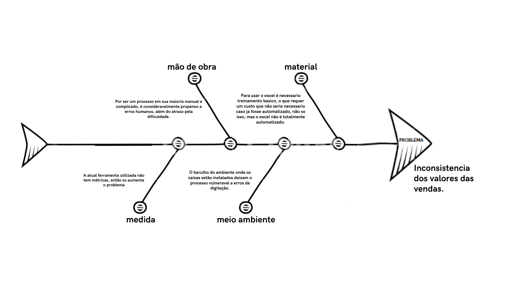

# VISÃO DO PRODUTO E PROJETO

## 1. VISÃO GERAL DO PRODUTO

### 1.1 Problema

O problema em questão envolve a gestão do fluxo de caixa nas lojas da empresa Natural Brasil, devido a deficiências no sistema atual (Gladium). Ele emite notas fiscais, mas não controla pagamentos a prazo. O controle é manual, feito no Excel, sujeito a erros de comunicação e exigindo treinamento para os funcionários. Além disso, a falta de integração para importar dados de pix/transferências bancárias pode causar erros. Isso resultou em imprecisões notadas pela cliente ao revisar planilhas. A empresa depende muito de processos manuais, carece de uma estrutura organizacional eficiente para arquivar documentos e extratos bancários, e não possui sistemas de verificação de erros. Isso torna o trabalho propenso a erros, como destacado pela cliente.

Figura 1 - Diagrama de Ishikawa

### 1.2 Declaração de Posição do Produto

| Para          | comerciantes                                                                                                                                                                                                                                                                                                                                                        |
| ------------- | ------------------------------------------------------------------------------------------------------------------------------------------------------------------------------------------------------------------------------------------------------------------------------------------------------------------------------------------------------------------- |
| Quem          | que precisam de uma forma de gerenciar o fluxo dos caixas das lojas de diversos meios de pagamento                                                                                                                                                                                                                                                                  |
| O Tabeçai     | é uma aplicação web de dashboard que serve como organizador e agregador de transações                                                                                                                                                                                                                                                                               |
| Que           | faz o controle de vendas tanto a vista quanto a prazo de maneira integrada com os caixas, a fim de melhorar a comunicação com o setor financeiro da empresa, assim produzindo resultados confiáveis e de maneira eficiente                                                                                                                                          |
| Ao contrário  | do sistema atualmente usado na empresa, chamado Gladium, que é uma plataforma para fazer as vendas (emissão de notas fiscais)                                                                                                                                                                                                                                       |
| Nosso produto | Consegue fazer o controle de pagamentos feitos a prazo, além de tirar o processo manual de transcrever as informações de pix e de transferências recebidas dos extratos bancários. Podendo também atrelar determinado pix à venda/cobrança informado pelo caixa, e produzir informações úteis sobre os resultados financeiros do dia ou de algum intervalo de tempo |

### 1.3 Objetivos do Produto

O objetivo do desenvolvimento deste produto é automatizar a administração do fluxo de caixa de todas as lojas, a fim de gerar resultados confiáveis, sem ter a necessidade do setor financeiro perder tempo checando transação por transação se os valores estão corretos ou não. O atual processo manual de registro de transações em planilhas, que demonstrou ser propenso a erros, será substituído por um sistema automatizado, fornecendo uma solução de software que otimize o gerenciamento do fluxo de caixa, minimizando erros, economizando tempo e recursos e proporcionando maior segurança nas operações financeiras das lojas em questão.

